# Hybrid Cloud HomeLab Infrastructure

A Raspberry Pi 5 based self-hosted infrastructure engineering project focused on building a scalable NAS, Private Cloud, Hybrid Storage System, Intelligent Routing Platform, CI/CD Automated Hosting Environment, and Monitoring Infrastructure using completely open-source and always-free technologies.

---

# Project Overview

Hybrid Cloud HomeLab Infrastructure (HCHI) is a self-hosted infrastructure engineering project designed to build a scalable, low-cost, modular, and cloud-like environment using Raspberry Pi 5 and open-source technologies.

The project focuses on simulating real-world cloud infrastructure, DevOps workflows, storage systems, routing architectures, monitoring platforms, and automated deployment environments within a self-hosted homelab ecosystem.

The infrastructure is designed to provide hands-on implementation experience in:

* Linux server administration
* Infrastructure engineering
* Docker containerization
* Hybrid cloud architecture
* Self-hosted cloud services
* Automated CI/CD deployment systems
* Intelligent routing and reverse proxy management
* Monitoring and observability systems
* Infrastructure debugging and recovery workflows


# Project Phases

| Phase       | Description                                                  |
| ----------- | ------------------------------------------------------------ |
| **Phase-1** | NAS Infrastructure & Core Foundation                         |
| **Phase-2** | Private Cloud Infrastructure                                 |
| **Phase-3** | Hybrid Storage Infrastructure                                |
| **Phase-4** | Intelligent Routing & CI/CD Automated Hosting Infrastructure |
| **Phase-5** | Monitoring & Observability Infrastructure                    |

---

# Current Documentation Focus

# Phase-1 — NAS Infrastructure & Cloud Foundation

The goal of Phase-1 is to build a stable, scalable, and recovery-safe NAS foundation capable of supporting future private cloud services, hybrid cloud integration, intelligent routing systems, Dockerized application hosting environments, CI/CD workflows, and monitoring infrastructure.

Phase-1 establishes the core infrastructure layer required for all future phases of the project.

---

# Phase-1 Includes

* Ubuntu Server setup
* Persistent external SSD storage
* Docker-ready infrastructure
* Samba NAS configuration
* SSH-based remote management
* Wireless infrastructure optimization
* EXT4 storage management
* Backup-ready storage architecture
* Recovery-safe mounting configuration
* Infrastructure monitoring utilities

---

# Vision & Goal

The main vision behind this project is to build a real-world self-hosted infrastructure platform capable of providing:

* Centralized storage
* Private cloud services
* Hybrid cloud integration
* Containerized application hosting
* Monitoring and observability
* Remote infrastructure management
* Scalable homelab experimentation

The project was also designed as a practical learning platform for:

* Linux server administration
* Infrastructure engineering
* Cloud architecture
* Docker containerization
* Storage management
* Networking
* System recovery and troubleshooting
* Real-world debugging

---

# Phase-1 Goal

Phase-1 focuses on building a stable NAS and infrastructure foundation for future private cloud, hybrid cloud, routing, hosting, CI/CD automation, and monitoring phases.

---

# Main Objectives of Phase-1

* Configure a stable Ubuntu Server environment
* Set up persistent external SSD storage
* Build a wireless NAS using Samba
* Configure Docker infrastructure
* Enable remote SSH management
* Improve wireless NAS performance
* Prepare storage architecture for future cloud services
* Build a recovery-safe infrastructure foundation

---

# Features

* Self-hosted NAS
* Docker-ready infrastructure
* External SSD storage
* Wireless SSH management
* SMB/Samba file sharing
* Android + PC NAS access
* 5 GHz Wi-Fi optimized setup
* Persistent storage mounting
* Backup-ready architecture
* Recovery-hardened configuration
* EXT4 journaling filesystem
* Infrastructure monitoring utilities

---


# Hardware Used

| Component             | Details                     |
| --------------------- | --------------------------- |
| Single Board Computer | Raspberry Pi 5 (8GB RAM)    |
| Primary Storage       | 512GB NVMe SSD              |
| SSD Interface         | External USB NVMe Enclosure |
| OS Storage            | 32GB microSD Card           |
| Cooling Solution      | Raspberry Pi 5 Cooling Fan  |
| Network               | 5 GHz Wi-Fi                 |
| Power Supply          | Official Raspberry Pi 5 PSU |

---

# Software Stack

| Technology           | Purpose                                 |
| -------------------- | --------------------------------------- |
| Ubuntu Server        | Base operating system                   |
| Docker               | Container platform                      |
| Docker Compose       | Multi-container orchestration           |
| Samba                | NAS file sharing                        |
| EXT4                 | Linux journaling filesystem             |
| SSH                  | Remote server management                |
| UFW                  | Firewall and access control             |
| SMART Tools          | SSD health monitoring                   |
| Monitoring Utilities | System diagnostics and monitoring tools |

---
# Why This Stack?

| Technology | Reason for Selection |
|---|---|
| **Ubuntu Server** | Selected because it is lightweight, stable, widely supported, and commonly used in real-world server environments. |
| **Docker** | Chosen to support scalable and isolated service deployment for future private cloud and monitoring phases. |
| **Samba** | Used to provide cross-platform NAS access between Windows, Android, and Linux systems. |
| **EXT4 Filesystem** | Selected for its journaling capabilities, reliability, and strong Linux compatibility. |
| **Raspberry Pi 5** | Chosen to build a low-cost, energy-efficient, and scalable infrastructure platform. |
| **External NVMe SSD** | Used to provide faster storage performance compared to traditional HDD-based NAS setups. |

---

# Architecture

<p align="center">
  
</p>

<p align="center">
  <i>Phase-1 NAS Infrastructure & Cloud Foundation Architecture</i>
</p>

---
---

# Storage Structure

<p align="center">
  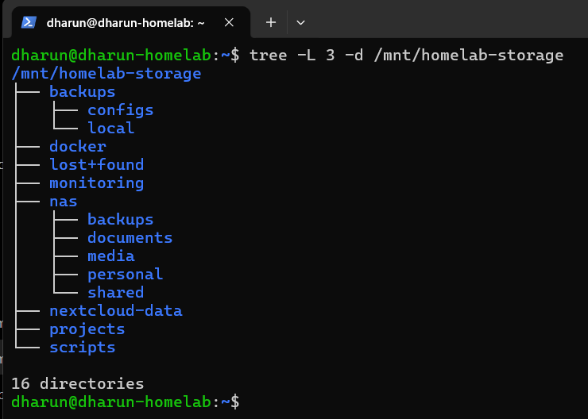
</p>

<p align="center">
  <i>Directory structure of the mounted NAS storage architecture.</i>
</p>

```text
/mnt/homelab-storage
├── backups
├── docker
├── monitoring
├── nas
│   ├── backups
│   ├── documents
│   ├── media
│   ├── personal
│   └── shared
├── nextcloud-data
└── scripts
```

---

# Phase-1 Implementation

## 1. Ubuntu Server Installation

- Installed Ubuntu Server on Raspberry Pi 5
- Configured wireless server setup
- Enabled SSH access

<p align="center">
  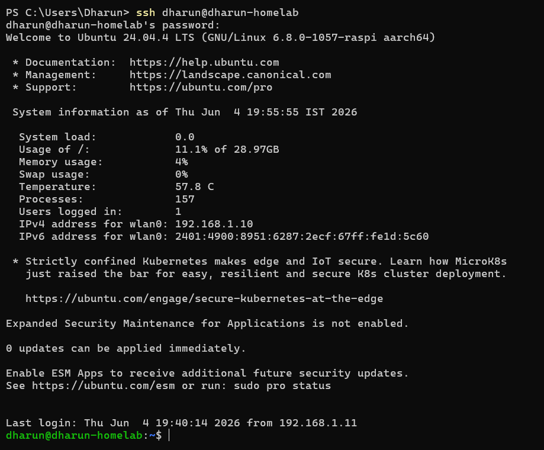
</p>

<p align="center">
  <i>Ubuntu Server running.</i>
</p>

<p align="center">
  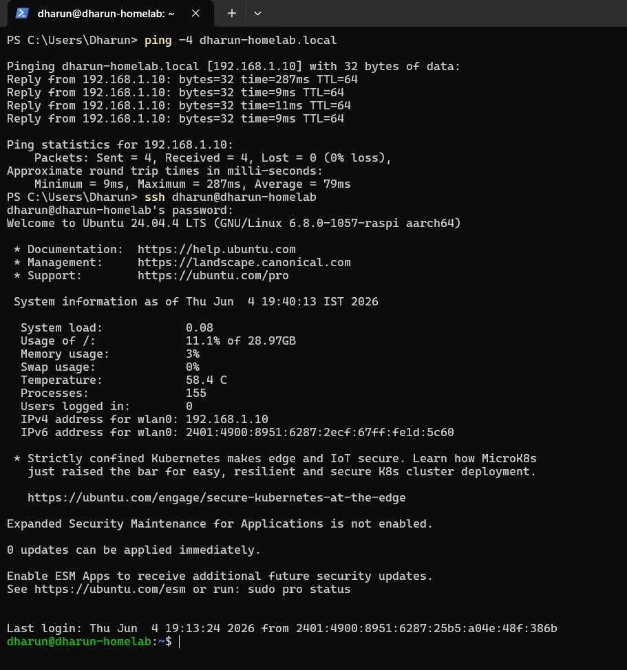
</p>

<p align="center">
  <i>SSH login terminal</i>
</p>

---

## 2. Static IP Configuration

- Configured static IP using Netplan
- Established stable local network access

<p align="center">
  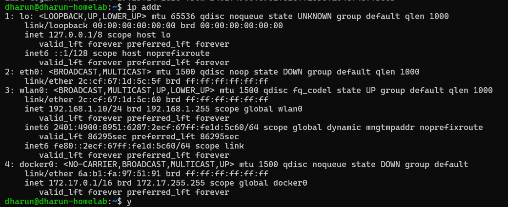
</p>

<p align="center">
  <i>static IP</i>
</p>

<p align="center">
  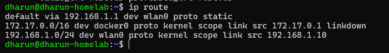
</p>

<p align="center">
  <i>stable local network access</i>
</p>

### Screenshot Placeholder
> Add screenshot:
> - `ip addr`
> - `ip route`

---

## 3. SSD Formatting & Mounting

- Formatted NVMe SSD using EXT4
- Mounted SSD to `/mnt/homelab-storage`
- Configured automatic mounting using `fstab`
- Added `nofail` option for recovery-safe booting


<p align="center">
  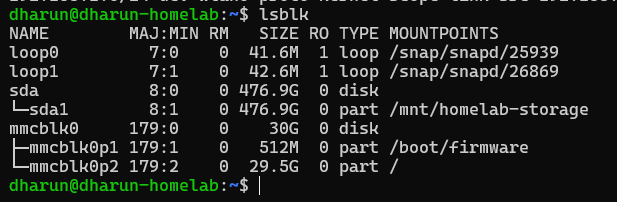
</p>

<p align="center">
  <i>NVMe SSD detected successfully by the Raspberry Pi system.</i>
</p>

---

<p align="center">
  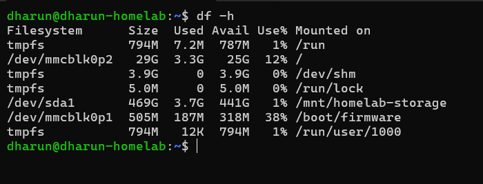
</p>

<p align="center">
  <i>External SSD mounted successfully at <code>/mnt/homelab-storage</code>.</i>
</p>

---

<p align="center">
  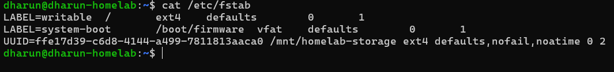
</p>

<p align="center">
  <i>Persistent and recovery-safe SSD mounting configured using <code>fstab</code>.</i>
</p>

---

## 4. Docker Installation

- Installed Docker Engine
- Verified Docker functionality
- Prepared container infrastructure

---

<p align="center">
  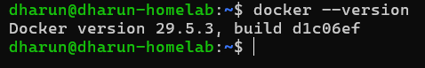
</p>

<p align="center">
  <i>Docker Engine installed and verified successfully on Raspberry Pi 5.</i>
</p>

---

<p align="center">
  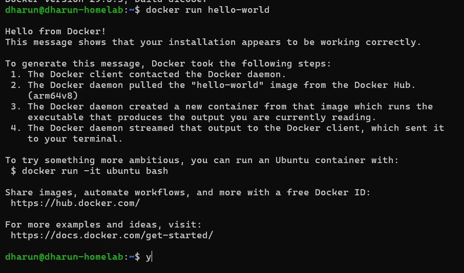
</p>

<p align="center">
  <i>Docker container executed successfully using the hello-world image.</i>
</p>

---

## 5. Samba NAS Configuration

- Configured Samba shares
- Enabled NAS access from Windows and Android devices
- Tested file transfer functionality

---

<p align="center">
  
</p>

<p align="center">
  <i>Samba NAS share accessed successfully from Windows system.</i>
</p>

---

<p align="center">
  
</p>

<p align="center">
  <i>NAS storage accessed successfully from Android device.</i>
</p>

---

<p align="center">
  
</p>

<p align="center">
  <i>Samba share configuration inside the Raspberry Pi server.</i>
</p>

---

## 6. Wi-Fi Optimization

Initially, the NAS infrastructure was connected using 2.4 GHz Wi-Fi, which resulted in very low file transfer speeds and unstable NAS performance.

After debugging and optimization:
- The Raspberry Pi was repositioned closer to the router
- The wireless connection switched from 2.4 GHz to 5 GHz
- NAS transfer performance improved significantly
- Wireless stability became more reliable for SSH and Samba operations

---

<p align="center">
  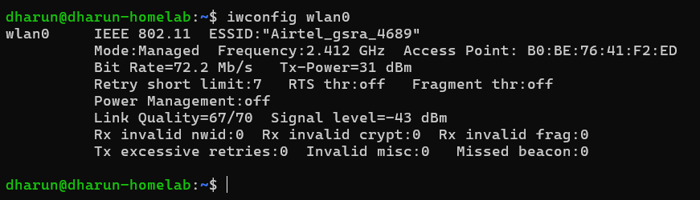
</p>

<p align="center">
  <i>Initial Raspberry Pi connection operating on 2.4 GHz Wi-Fi.</i>
</p>

---

<p align="center">
  
</p>

<p align="center">
  <i>Raspberry Pi successfully connected to 5 GHz Wi-Fi after optimization.</i>
</p>

---

<p align="center">
  
</p>

<p align="center">
  <i>Improved NAS file transfer performance after migrating to 5 GHz Wi-Fi.</i>
</p>

---

## 7. Monitoring & Utilities

To improve infrastructure visibility, monitoring, diagnostics, and system analysis capabilities, several lightweight Linux monitoring and utility tools were installed and configured.

Installed utilities:
- `htop`
- `btop`
- `ncdu`
- `nload`
- `vnstat`
- SMART monitoring tools

These tools help monitor:
- CPU usage
- RAM utilization
- Disk usage
- Network traffic
- SSD health
- Storage statistics
- Real-time system activity

---

<p align="center">
  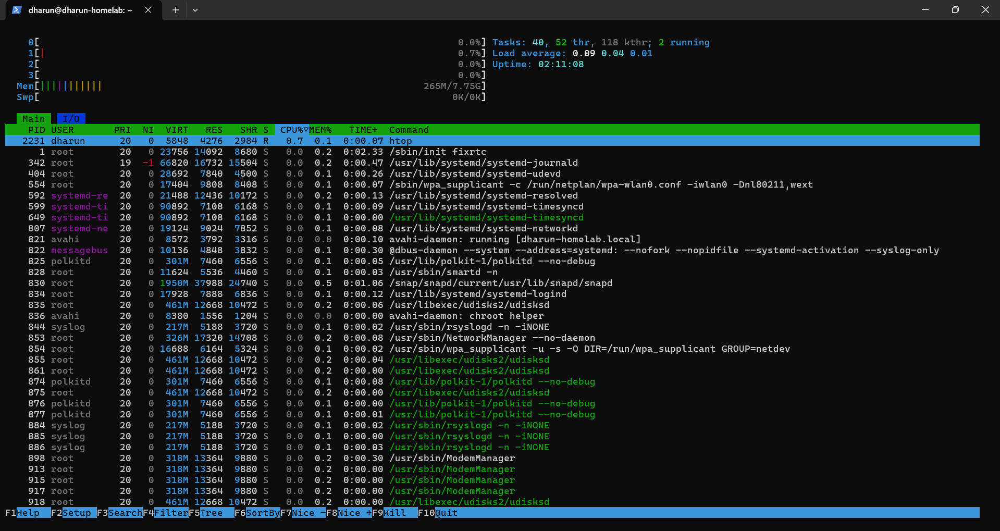
</p>

<p align="center">
  <i>System monitoring and diagnostic utilities running on the Raspberry Pi server.</i>
</p>

---

<p align="center">
  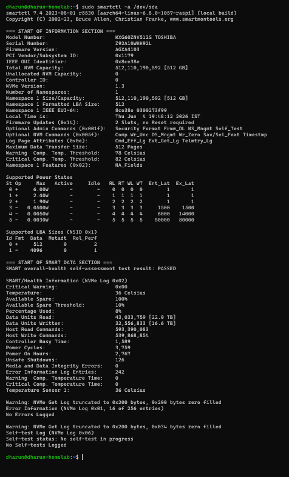
</p>

<p align="center">
  <i>SMART-based SSD health verification and storage diagnostics.</i>
</p>

---
## 8. Backup Preparation

To prepare the infrastructure for future recovery, hybrid storage integration, and cloud expansion, a local backup architecture foundation was created inside the NAS storage environment.

This setup included:
- Creating dedicated backup directories
- Organizing backup storage structure
- Preparing automated backup script foundations
- Establishing recovery-ready storage planning

The backup system is intended to support future:
- Local backup automation
- Hybrid cloud backup integration
- Infrastructure recovery workflows
- Configuration backup management

---

<p align="center">
  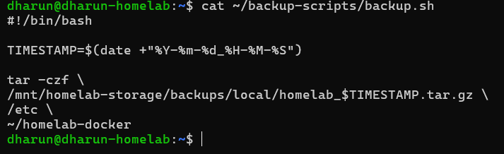
</p>

<p align="center">
  <i>Backup directory structure created inside the NAS storage environment.</i>
</p>

---

<p align="center">
  
</p>

<p align="center">
  <i>Initial backup script preparation for future automated backup workflows.</i>
</p>

---

<p align="center">
  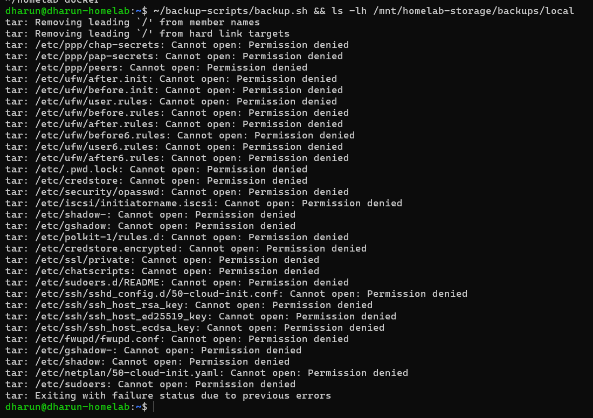
</p>

<p align="center">
  <i>Backup script execution and archive generation verification.</i>
</p>

---

# Working Demonstration

## NAS Access

The NAS infrastructure was successfully accessed and tested from multiple client devices within the local network environment.

Successful client access included:
- Windows PC
- Android smartphone

The Samba-based NAS environment enabled seamless cross-platform file access and storage management through the Raspberry Pi infrastructure.

---

<p align="center">
  
</p>

<p align="center">
  <i>NAS storage successfully accessed from a Windows system using Samba shares.</i>
</p>

---

<p align="center">
  
</p>

<p align="center">
  <i>NAS storage successfully accessed from an Android device.</i>
</p>

---

# File Transfer Testing

Large media files were transferred successfully through the Samba NAS infrastructure to validate:
- NAS functionality
- Wireless transfer capability
- SSD storage accessibility
- Cross-platform file operations

The tests confirmed stable NAS communication between the Raspberry Pi server and connected client devices.

---

<p align="center">
  
</p>

<p align="center">
  <i>Large file transfer operation between client system and NAS storage.</i>
</p>

---

<p align="center">
  
</p>

<p align="center">
  <i>Directory structure and files stored inside the NAS environment.</i>
</p>

---

<p align="center">
  
</p>

<p align="center">
  <i>Wireless NAS transfer performance after 5 GHz Wi-Fi optimization.</i>
</p>

---

# Challenges, Errors & Debugging

| Issue | Root Cause | Solution |
|---|---|---|
| Very slow NAS speed (~1.5 MB/s) | Connected to 2.4 GHz Wi-Fi | Switched to 5 GHz Wi-Fi |
| Emergency boot mode | Missing SSD during boot | Added `nofail` in `fstab` |
| SSD not mounting | UUID mismatch | Updated UUID in `fstab` |
| SSH instability | Wireless connection behavior | Reconfigured wireless settings |
| Storage mounting failure | Incorrect mount configuration | Corrected mount structure |
| Recovery boot issues | External storage dependency | Implemented recovery-safe mounting |

---

# Performance Results

| Test | Result |
|---|---|
| 2.4 GHz NAS Transfer | ~1.5 MB/s |
| 5 GHz NAS Transfer | ~10–13 MB/s |
| SSD Mounting | Successful |
| Docker Engine | Working |
| SSH Access | Working |
| NAS Access | Successful |

---

# Security Considerations

- UFW firewall enabled
- SSH-based remote management
- Local network restricted access
- EXT4 journaling filesystem
- Recovery-safe SSD mounting using `nofail`
- External SSD isolation from OS storage

---

# Lessons Learned

- External storage mounting requires careful `fstab` configuration
- UUID mismatches can break automatic mounting
- 5 GHz Wi-Fi significantly improves NAS performance
- Recovery planning is extremely important in infrastructure systems
- Linux infrastructure debugging requires systematic troubleshooting
- Persistent storage architecture is critical for cloud-based systems

---

# Suggestions From Experience

- Always use proper recovery-safe mount configurations
- Use 5 GHz Wi-Fi for wireless NAS performance
- Verify SSD UUIDs carefully before configuring `fstab`
- Avoid unnecessary low-level modifications after achieving stability
- Use official power supplies for Raspberry Pi infrastructure projects
- Build infrastructure phase-by-phase instead of configuring everything at once

---

# Hardware Setup Photos

The physical infrastructure setup was assembled using Raspberry Pi 5 hardware, external NVMe SSD storage, active cooling, and wireless network connectivity to create a compact and scalable homelab environment.

The setup was designed to maintain:
- Low power consumption
- Compact deployment
- Efficient cooling
- Expandable storage architecture
- Clean cable management
- Long-term infrastructure scalability

---

### Raspberry Pi 5 Setup

<p align="center">
  
</p>

<p align="center">
  <i>Primary Raspberry Pi 5 infrastructure system used for the homelab environment.</i>
</p>

---

### External NVMe SSD Enclosure

<p align="center">
  
</p>

<p align="center">
  <i>External NVMe SSD enclosure connected to the Raspberry Pi infrastructure.</i>
</p>

---

### Cooling System

<p align="center">
  
</p>

<p align="center">
  <i>Active cooling solution used to maintain stable Raspberry Pi operating temperatures.</i>
</p>

---

### Complete Hardware Infrastructure

<p align="center">
  
</p>

<p align="center">
  <i>Complete Phase-1 Hybrid Cloud HomeLab Infrastructure hardware setup.</i>
</p>

---

### Cable Management & Connectivity

<p align="center">
  
</p>

<p align="center">
  <i>Power, storage, and connectivity arrangement of the infrastructure setup.</i>
</p>

---

# Future Scope

## Phase-2 — Private Cloud
- Nextcloud deployment
- Database containers
- Redis integration
- Persistent container storage

## Phase-3 — Hybrid Storage
- AWS S3 integration
- Cloud backup architecture
- Hybrid storage synchronization

## Phase-4 — Routing
- Intelligent routing
- Reverse proxy
- Internal traffic management

## Phase-5 — Monitoring
- Infrastructure monitoring
- Dashboards
- Alerting systems
- Performance observability

---

# Final Outcome

Phase-1 successfully established a stable NAS and infrastructure foundation using Raspberry Pi 5, Docker, Samba, and external SSD storage.

The system now supports:
- NAS functionality
- Docker infrastructure
- Persistent storage
- Wireless management
- Recovery-safe architecture
- Future private cloud expansion

This phase created the core infrastructure foundation required for future private cloud, hybrid cloud, routing, and monitoring implementations.

---

# Author

**Dharun R**

Hybrid Cloud HomeLab Infrastructure Project
