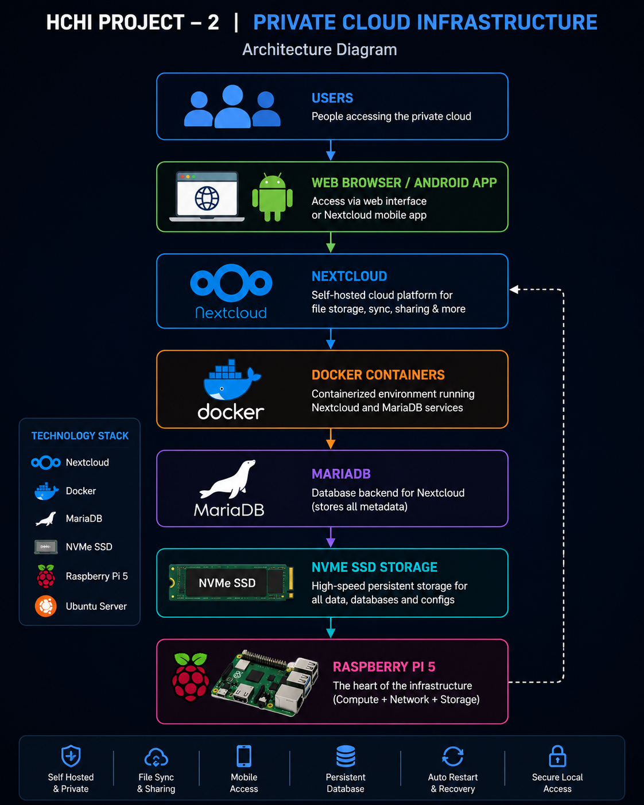
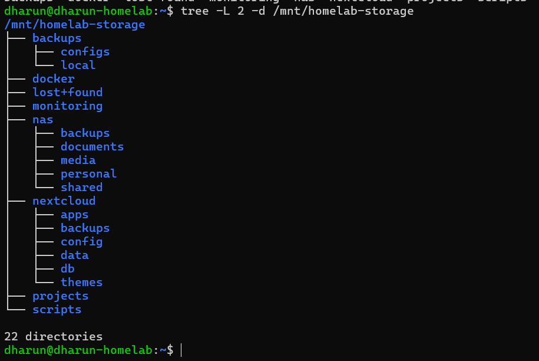
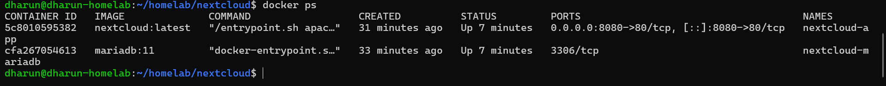
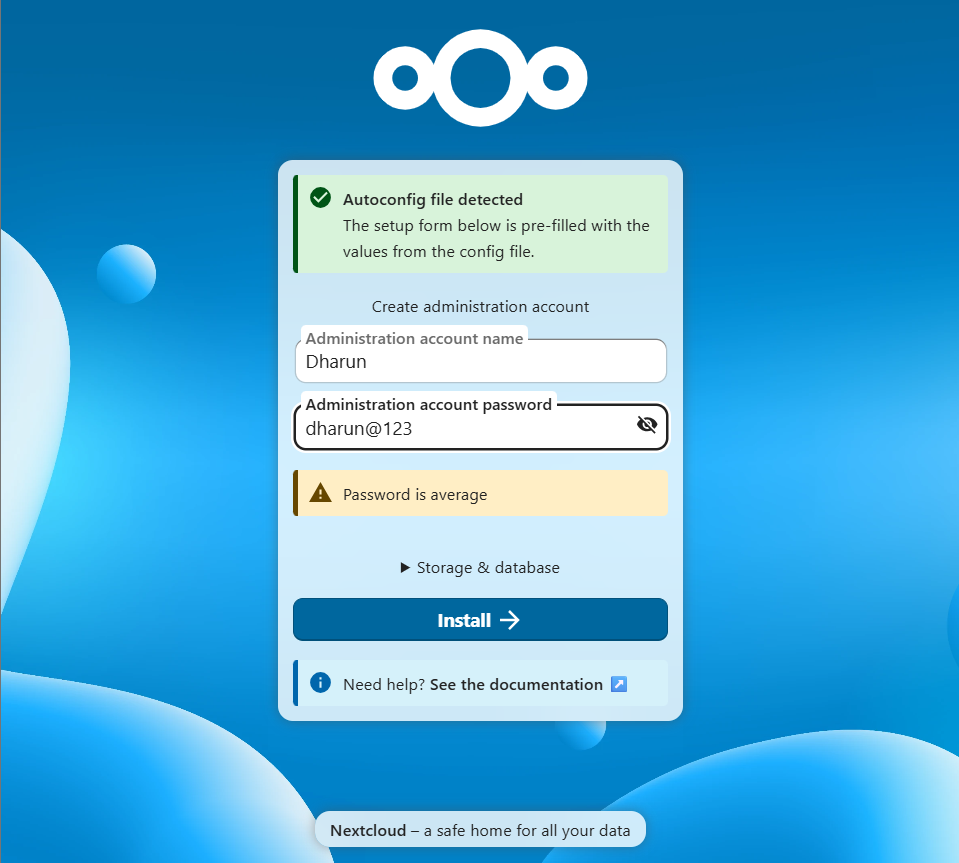
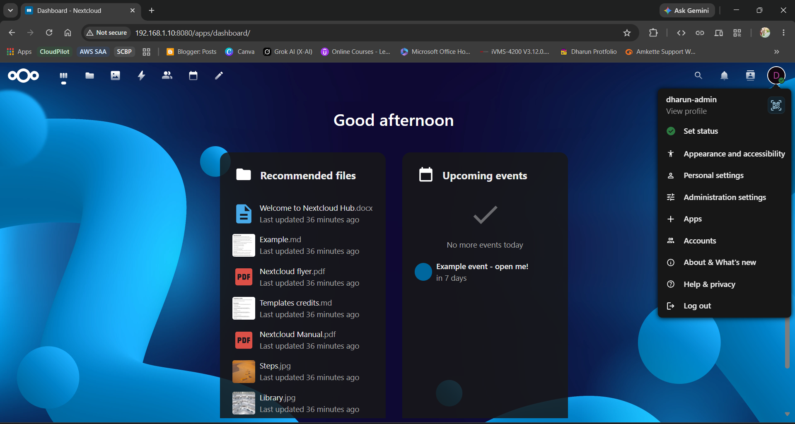
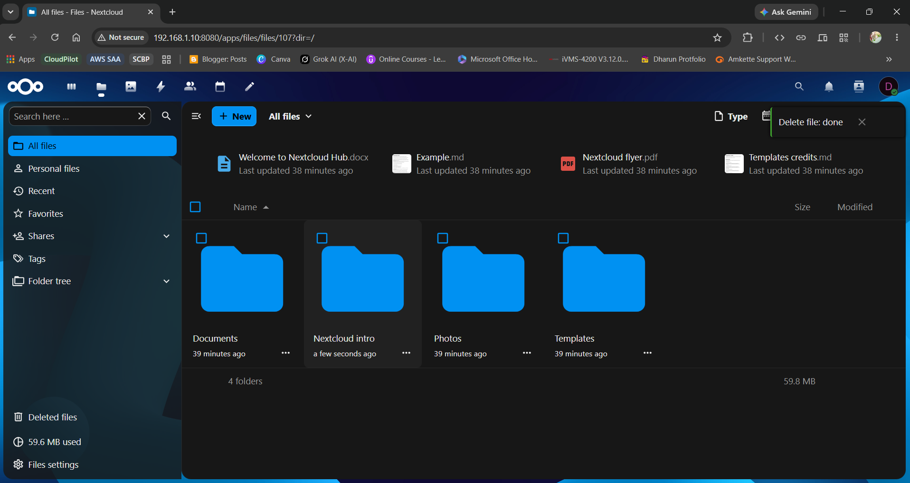
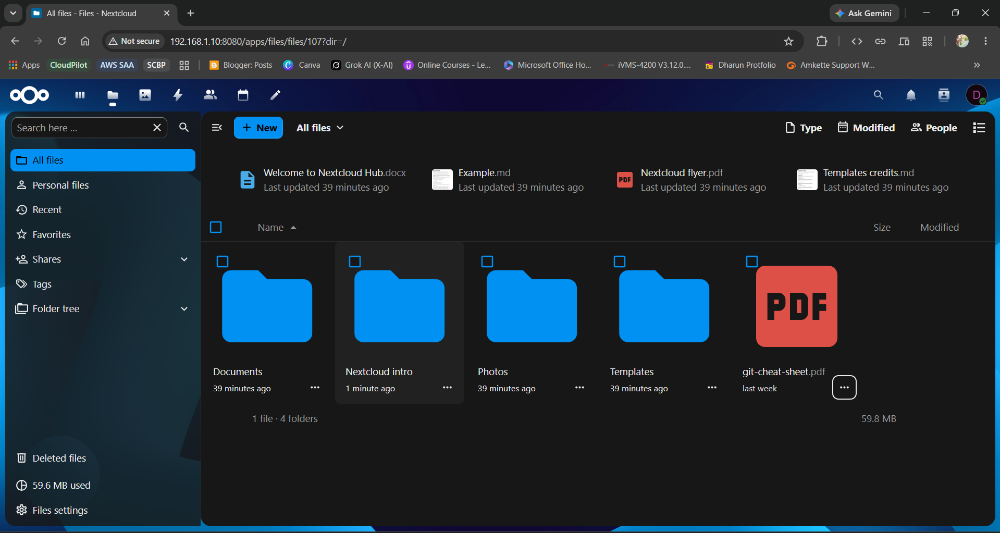
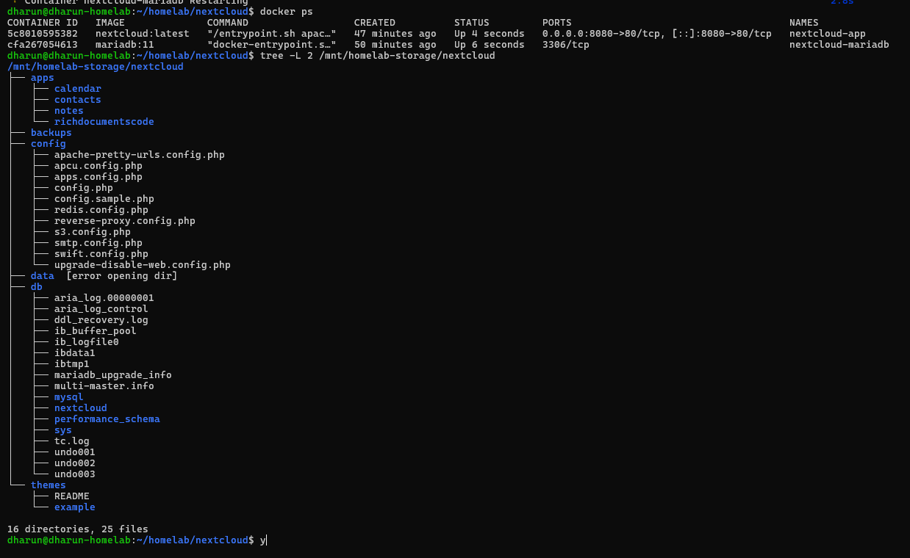
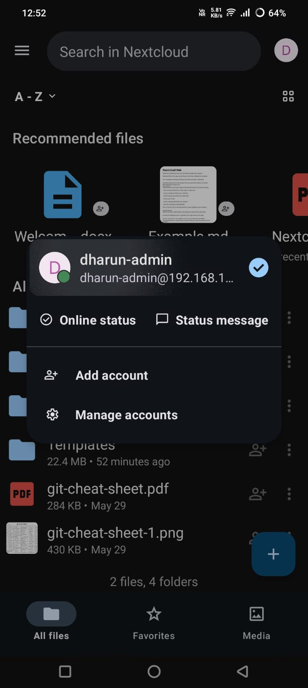

# ☁️ Project - 2 : Private Cloud Infrastructure

## 📌 Overview

The **Private Cloud Infrastructure** phase of the **Hybrid Cloud HomeLab Infrastructure (HCHI)** project focuses on transforming the Raspberry Pi 5 into a fully self-hosted private cloud platform using containerized infrastructure.

This phase introduces:

* Self-hosted cloud storage
* Web-based file access
* Mobile synchronization
* Persistent containerized infrastructure
* Database-backed cloud architecture

The infrastructure was deployed using Docker containers with persistent NVMe SSD storage and integrated cloud management through Nextcloud.

---

# 🚀 Includes

* Raspberry Pi 5 Private Cloud Server
* Dockerized Infrastructure
* Nextcloud Deployment
* MariaDB Database Integration
* Persistent NVMe SSD Storage
* Android App Synchronization
* Automatic Container Recovery
* Local Network Cloud Access
* Self-Hosted File Management System

---

# 🎯 Vision & Goal

The goal of this phase is to build a scalable and production-style private cloud infrastructure capable of:

* Replacing traditional cloud storage services
* Providing self-hosted file synchronization
* Enabling centralized storage management
* Creating a foundation for future hybrid cloud integration with AWS
* Preparing infrastructure for remote global access in future phases

This phase acts as the foundation for future:

* Hybrid Cloud Backups
* HTTPS & Reverse Proxy Infrastructure
* Remote Global Access
* Monitoring & Observability Systems

---

# ✨ Features

* Self-hosted cloud storage platform
* Browser-based file management
* Android application support
* Persistent Docker containers
* Database-backed infrastructure
* Automatic restart after reboot
* Multi-folder cloud storage management
* Secure local network access
* Modular infrastructure architecture

---

# 🛠️ Technology Stack

| Category         | Technology              |
| ---------------- | ----------------------- |
| Hardware         | Raspberry Pi 5          |
| Operating System | Ubuntu Server           |
| Containerization | Docker & Docker Compose |
| Cloud Platform   | Nextcloud               |
| Database         | MariaDB                 |
| Storage          | 512GB NVMe SSD          |
| Networking       | Local Area Network      |
| Remote Access    | Planned in Future Phase |

---

# ❓ Why This Stack?

## Raspberry Pi 5

Chosen for:

* low power consumption
* compact infrastructure deployment
* ARM64 support
* excellent Linux compatibility

## Docker

Chosen for:

* container isolation
* scalability
* easy deployment
* infrastructure portability

## Nextcloud

Chosen for:

* self-hosted cloud capabilities
* Android integration
* web-based file management
* future hybrid cloud compatibility

## MariaDB

Chosen for:

* lightweight database performance
* excellent compatibility with Nextcloud
* reliability for persistent storage metadata

## NVMe SSD

Chosen for:

* high-speed storage
* lower latency
* better reliability than SD cards
* improved cloud storage performance

---

# 💻 Hardware Used

| Hardware                  | Description                 |
| ------------------------- | --------------------------- |
| Raspberry Pi 5            | Main server                 |
| 512GB NVMe SSD            | Persistent storage          |
| Official Raspberry Pi PSU | Stable power supply         |
| Wi-Fi Router              | Network connectivity        |
| Ethernet/Wi-Fi            | Local network communication |

---

# 🏗️ Architecture

```text
Users
   ↓
Web Browser / Android App
   ↓
Nextcloud
   ↓
Docker Containers
   ↓
MariaDB
   ↓
NVMe SSD Storage
   ↓
Raspberry Pi 5
```

<p align="center">
  
</p>

<p align="center">
  <i>Architecture diagram of the Private Cloud Infrastructure deployed on Raspberry Pi 5.</i>
</p>

---

# 📂 Storage Architecture

```text
/mnt/homelab-storage
├── backups
├── docker
├── monitoring
├── nas
├── nextcloud
│   ├── apps
│   ├── backups
│   ├── config
│   ├── data
│   ├── db
│   └── themes
├── scripts
└── temp
```

<p align="center">
  
</p>

<p align="center">
  <i>Directory structure of the private cloud storage architecture.</i>
</p>

---

# 🌐 Platform Features

## ✅ Web UI Access

* Browser-based cloud dashboard
* File upload & download
* Folder management
* Multi-device access

## ✅ Android Integration

* Mobile synchronization
* Automatic photo backup
* Remote file access

## ✅ Persistent Storage

* NVMe SSD backed storage
* Persistent Docker volumes
* Database persistence

## ✅ Installed Applications

* Calendar
* Contacts
* Notes

---

# 🖼️ Screenshots

---

## 🔹 Docker Containers Running

<p align="center">
  
</p>

<p align="center">
  <i>Running Nextcloud and MariaDB containers inside Docker.</i>
</p>

Command Used:

```bash
docker ps
```

---

## 🔹 Nextcloud Login Page

<p align="center">
  
</p>

<p align="center">
  <i>Nextcloud private cloud login interface.</i>
</p>

---

## 🔹 Nextcloud Dashboard

<p align="center">
  
</p>

<p align="center">
  <i>Main dashboard of the private cloud platform.</i>
</p>

---


## 🔹 Nextcloud Folder Structure

<p align="center">
  
</p>

<p align="center">
  <i>Directory structure of the Nextcloud persistent storage.</i>
</p>

---

## 🔹 File Upload Test

<p align="center">
  
</p>

<p align="center">
  <i>Testing file upload functionality inside the private cloud.</i>
</p>

---

## 🔹 Complete HCHI Storage Structure

<p align="center">
  
</p>

<p align="center">
  <i>Overall storage architecture of the HCHI infrastructure.</i>
</p>

Command Used:

```bash
tree -L 2 -d /mnt/homelab-storage/nextcloud
```

---

## 🔹 Android App Integration

<p align="center">
  
</p>

<p align="center">
  <i>Nextcloud Android application connected to the private cloud.</i>
</p>

---

# 🐳 Docker Infrastructure

The infrastructure was deployed using Docker Compose with the following services:

| Service   | Purpose                |
| --------- | ---------------------- |
| Nextcloud | Private cloud platform |
| MariaDB   | Database backend       |

## Container Features

* Persistent volume mapping
* Automatic restart policy
* Isolated container networking
* Modular deployment structure

Docker Restart Policy:

```yaml
restart: unless-stopped
```

---

# 🚀 Deployment Process

## 1. Created Storage Directories

```bash
sudo mkdir -p /mnt/homelab-storage/nextcloud/{data,db,config,apps,themes,backups}
```

---

## 2. Created Docker Compose Stack

Infrastructure deployed:

* Nextcloud
* MariaDB

---

## 3. Started Containers

```bash
docker compose up -d
```

---

## 4. Verified Running Containers

```bash
docker ps
```

---

## 5. Initialized Nextcloud

* Created admin account
* Connected MariaDB database
* Configured persistent storage

---

# 📊 Current Infrastructure Status

| Component            | Status       |
| -------------------- | ------------ |
| Docker               | ✅ Running    |
| MariaDB              | ✅ Running    |
| Nextcloud            | ✅ Running    |
| NVMe SSD             | ✅ Mounted    |
| Persistent Volumes   | ✅ Configured |
| Android App Sync     | ✅ Working    |
| Local Network Access | ✅ Working    |

---

# 🔄 Auto Recovery & Persistence

The infrastructure supports:

* Automatic restart after reboot
* Persistent storage mapping
* Automatic container recovery
* Database persistence
* Recovery after unexpected shutdowns

Infrastructure flow:

```text
Ubuntu Boot
   ↓
Docker Service Starts
   ↓
Containers Restart Automatically
   ↓
Private Cloud Restored
```

---

# 🔐 Current Security State

## Enabled

* Docker container isolation
* Internal Docker networking
* Persistent storage separation
* Local network restricted access

## Planned for Future Phases

* HTTPS SSL
* Reverse Proxy
* Domain Integration
* Cloudflare Tunnel
* Firewall Hardening
* Fail2Ban Protection

---

# 📚 Key Learning Outcomes

This phase provided hands-on experience with:

* Self-hosted cloud infrastructure
* Docker container orchestration
* Persistent storage architecture
* Database-backed applications
* Linux server administration
* Container networking
* Cloud platform deployment
* Storage engineering concepts

---

# ✅ Final Outcome

Successfully built a fully self-hosted private cloud platform on Raspberry Pi 5 using Docker, Nextcloud, and MariaDB with persistent NVMe SSD storage.

The infrastructure now supports:

* cloud-based file management
* browser access
* Android synchronization
* persistent containerized deployment
* automatic service recovery

This phase establishes the foundation for future:

* hybrid cloud backups
* internet-accessible infrastructure
* monitoring & observability systems

---

# Author

**Dharun R**

Hybrid Cloud HomeLab Infrastructure Project

---
