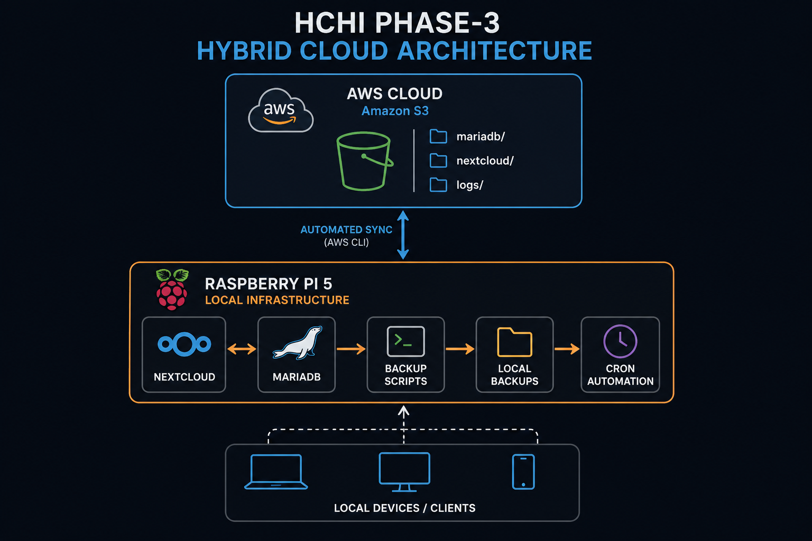
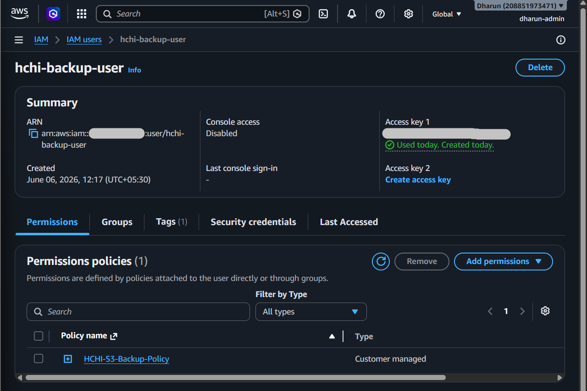
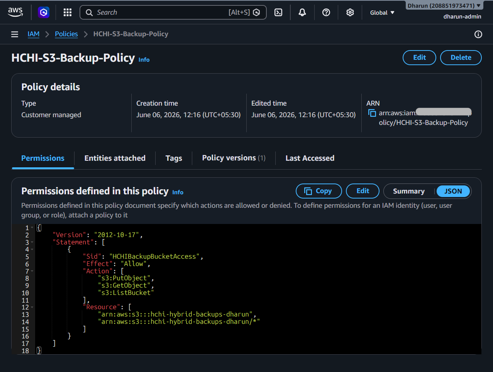
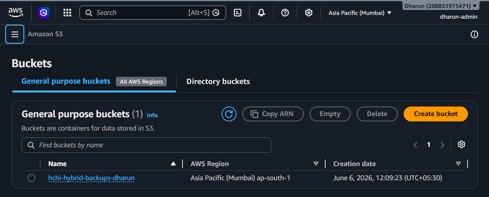
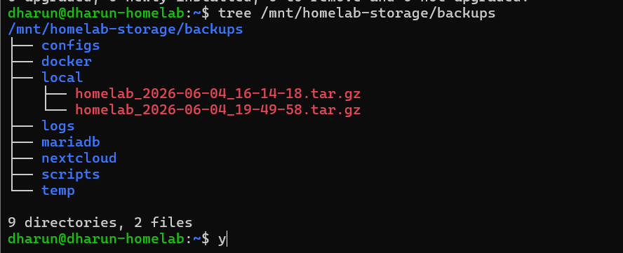
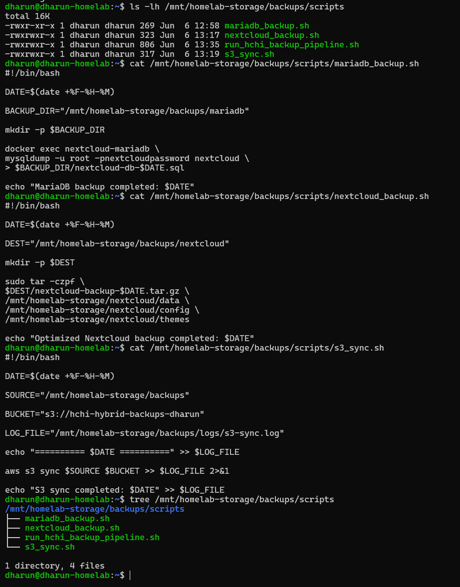
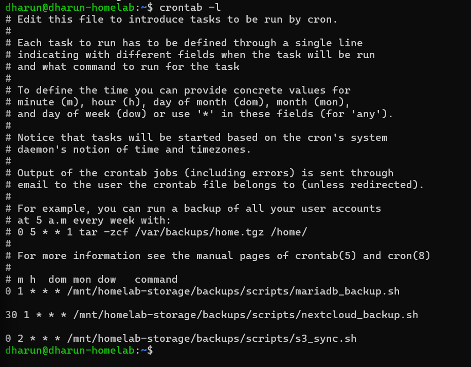
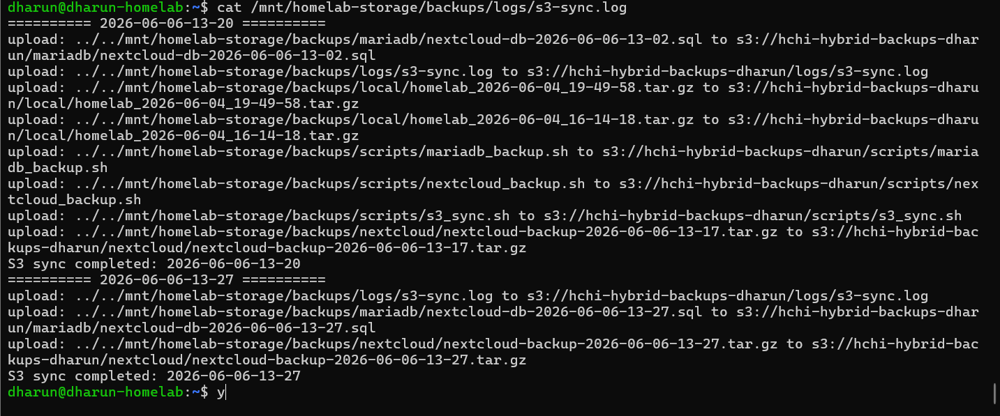
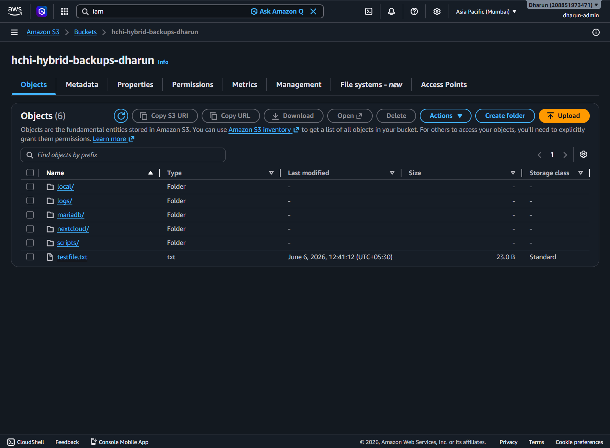
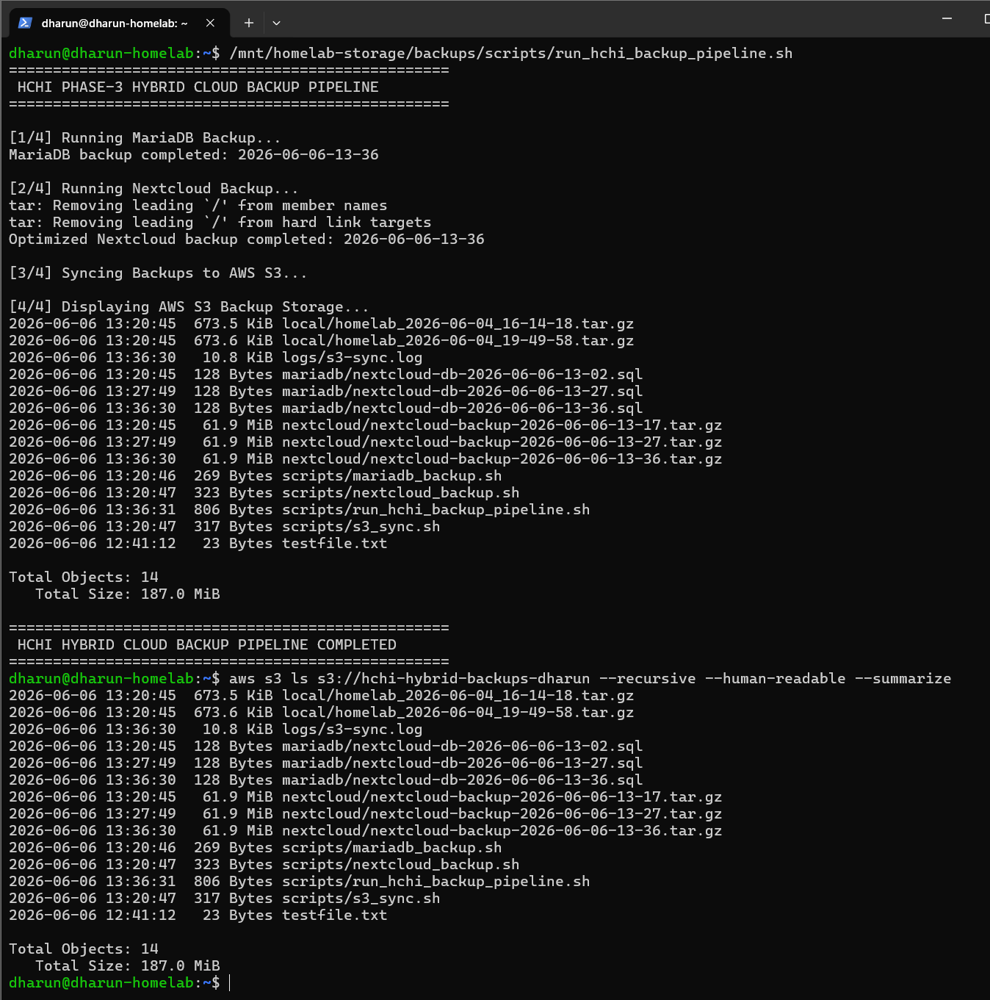

# ☁️ HCHI — Phase-3 Hybrid Storage Infrastructure

## Hybrid Cloud HomeLab Infrastructure (HCHI)

---

# 📌 Project Overview

Phase-3 of the **Hybrid Cloud HomeLab Infrastructure (HCHI)** project focuses on building a fully automated **Hybrid Storage Infrastructure** by integrating:

* Local Private Cloud Infrastructure
* AWS S3 Cloud Storage
* Automated Backup Pipelines
* Disaster Recovery Workflows
* Infrastructure Automation

This phase transforms the project from a simple self-hosted cloud into a true **Hybrid Cloud Architecture**.

---

# 🎯 Objectives

The main objectives of this phase were:

* Implement cloud redundancy using AWS S3
* Automate Nextcloud and MariaDB backups
* Build secure IAM-based cloud access
* Create scheduled backup pipelines
* Implement hybrid local + cloud storage architecture
* Design disaster recovery workflows
* Build infrastructure automation using Bash + Cron

---

# 🏗️ Hybrid Cloud Architecture

```text
                    ┌──────────────────────────┐
                    │        AWS Cloud         │
                    │──────────────────────────│
                    │ S3 Backup Storage        │
                    │ IAM Security             │
                    │ Cloud Redundancy         │
                    └──────────▲───────────────┘
                               │
                       Automated Sync
                               │
┌──────────────────────────────┴──────────────────────────────┐
│                     Raspberry Pi 5                         │
│─────────────────────────────────────────────────────────────│
│ Ubuntu Server                                              │
│ Docker Infrastructure                                       │
│ Nextcloud                                                   │
│ MariaDB                                                     │
│ Automated Backup Scripts                                    │
│ Cron Automation                                             │
└──────────────────────────────▲──────────────────────────────┘
                               │
                         Local Devices
```

---

# 🖼️ Architecture Diagram

<p align="center">
  
</p>

---

# 🛠️ Technologies Used

| Category          | Technologies   |
| ----------------- | -------------- |
| Hardware          | Raspberry Pi 5 |
| Operating System  | Ubuntu Server  |
| Containerization  | Docker         |
| Private Cloud     | Nextcloud      |
| Database          | MariaDB        |
| Cloud Provider    | AWS            |
| Cloud Storage     | Amazon S3      |
| Automation        | Bash Scripts   |
| Scheduling        | Cron           |
| Security          | IAM Policies   |
| Backup Tools      | mysqldump, tar |
| Cloud Integration | AWS CLI        |

---

# ☁️ AWS Hybrid Cloud Integration

This phase integrates the local infrastructure with AWS Cloud using:

* Amazon S3
* IAM User Policies
* AWS CLI
* Automated Backup Synchronization

The Raspberry Pi securely uploads backup archives to AWS S3 using a restricted IAM service account.

---

# 🔐 IAM Architecture

## IAM Design

```text
AWS Root Account
        │
        ├── dharun-admin
        │       └── Full Infrastructure Management
        │
        └── hchi-backup-user
                └── Restricted S3 Backup Access
```

---

# 🖼️ IAM User Configuration

<p align="center">
  
</p>

---

# 🖼️ IAM Policy Configuration

<p align="center">
  
</p>

---

# 🗂️ S3 Bucket Structure

```text
hchi-hybrid-backups-dharun/
├── mariadb/
├── nextcloud/
├── logs/
└── temp/
```

---

# 🖼️ AWS S3 Bucket

<p align="center">
  
</p>

---

# 📂 Local Backup Infrastructure

```text
/mnt/homelab-storage/backups/
├── mariadb/
├── nextcloud/
├── logs/
├── scripts/
└── temp/
```

---

# 🔄 Automated Backup Workflow

## Backup Pipeline

```text
Nextcloud + MariaDB
        ↓
Backup Scripts
        ↓
Compressed Archives
        ↓
Local Backup Storage
        ↓
AWS S3 Sync
        ↓
Cloud Redundancy
```

---

# 🧠 Backup Strategy

## MariaDB Backup

Database backups are performed using:

```bash
mysqldump
```

This ensures:

* logical database consistency
* reliable restoration
* safe backups while database is running

---

## Nextcloud Backup

Filesystem backups include:

* data/
* config/
* themes/

The following were intentionally excluded:

* raw database files
* unnecessary application binaries

This optimized:

* backup size
* storage efficiency
* upload performance

---

# 🖼️ Local Backup Files

<p align="center">
  
</p>

---

# ⚙️ Automation Scripts

## Implemented Scripts

| Script                      | Purpose                     |
| --------------------------- | --------------------------- |
| mariadb_backup.sh           | MariaDB dump automation     |
| nextcloud_backup.sh         | Nextcloud filesystem backup |
| s3_sync.sh                  | AWS S3 synchronization      |
| run_hchi_backup_pipeline.sh | Full backup orchestration   |

---

# 🖼️ Backup Scripts

<p align="center">
  
</p>

---

# 🔄 Cron Automation

Automated scheduling was implemented using Cron.

## Scheduled Jobs

| Time    | Task                   |
| ------- | ---------------------- |
| 1:00 AM | MariaDB Backup         |
| 1:30 AM | Nextcloud Backup       |
| 2:00 AM | AWS S3 Synchronization |

---

# 🖼️ Cron Configuration

<p align="center">
  
</p>

---

# 📜 S3 Sync Logging

Infrastructure logging was implemented for:

* operational visibility
* troubleshooting
* audit tracking

---

# 🖼️ S3 Sync Logs

<p align="center">
  
</p>

---

# ☁️ AWS S3 Verification

The project includes full cloud synchronization verification using:

```bash
aws s3 ls s3://hchi-hybrid-backups-dharun --recursive --human-readable --summarize
```

---

# 🖼️ AWS S3 Backup Verification

<p align="center">
  
</p>

---

# 🚀 Hybrid Backup Pipeline Demonstration

A master orchestration script was created to:

* trigger all backups
* synchronize to AWS S3
* display cloud backup status

using a single command.

---

# 🖼️ Full Backup Pipeline Execution

<p align="center">
  
</p>

---

# 🛡️ Security Engineering

## Implemented Security Practices

* Root account isolation
* Dedicated admin IAM user
* Dedicated backup IAM service account
* Least privilege access policy
* Bucket-level access restriction
* Encrypted S3 storage
* Secure AWS CLI authentication

---

# 🧠 Engineering Concepts Demonstrated

## Cloud Engineering

* AWS S3 integration
* IAM policy architecture
* Hybrid cloud workflows

---

## DevOps & Automation

* Bash scripting
* Cron automation
* Infrastructure orchestration

---

## Storage Engineering

* Backup architecture
* Compression workflows
* Cloud redundancy

---

## Linux Administration

* File permissions
* Ownership management
* Service integration

---

# 📈 Project Outcome

Phase-3 successfully transformed the infrastructure into a:

# Fully Automated Hybrid Cloud Backup Platform

with:

* local private cloud
* automated backups
* cloud redundancy
* AWS integration
* infrastructure automation
* disaster recovery workflows

---

# ✅ Phase-3 Status

| Component                   | Status      |
| --------------------------- | ----------- |
| AWS S3 Integration          | ✅ Completed |
| IAM Security Architecture   | ✅ Completed |
| Automated MariaDB Backups   | ✅ Completed |
| Automated Nextcloud Backups | ✅ Completed |
| S3 Synchronization          | ✅ Completed |
| Cron Automation             | ✅ Completed |
| Logging System              | ✅ Completed |
| Hybrid Cloud Architecture   | ✅ Completed |

---


# 👨‍💻 Author

## Dharun R

Hybrid Cloud HomeLab Infrastructure (HCHI)

---
