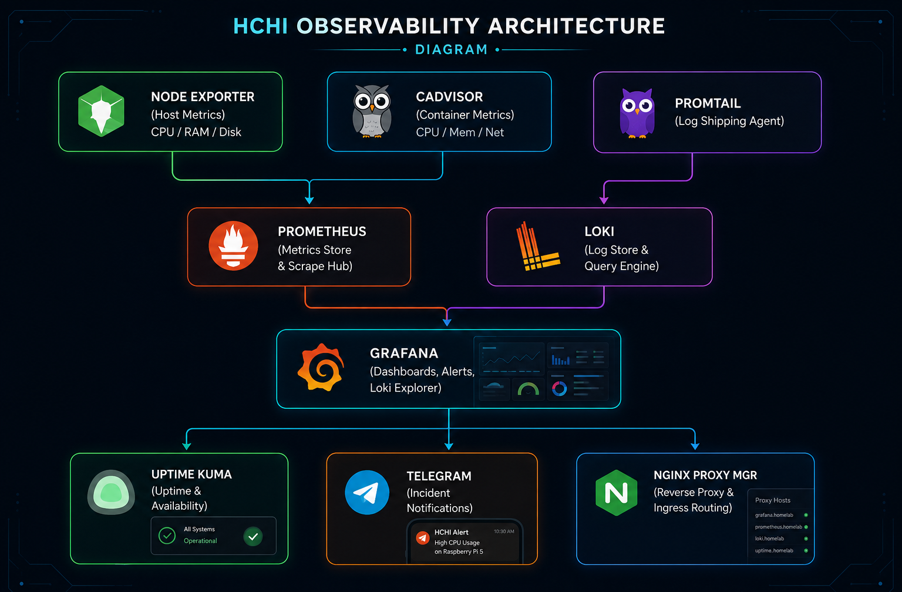
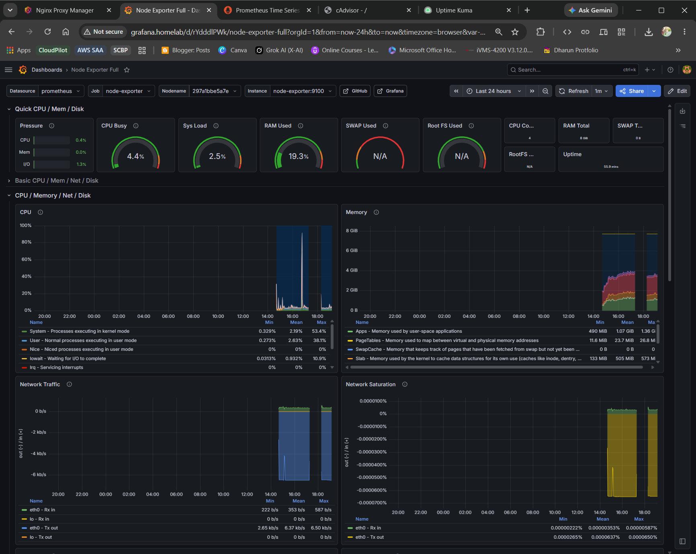
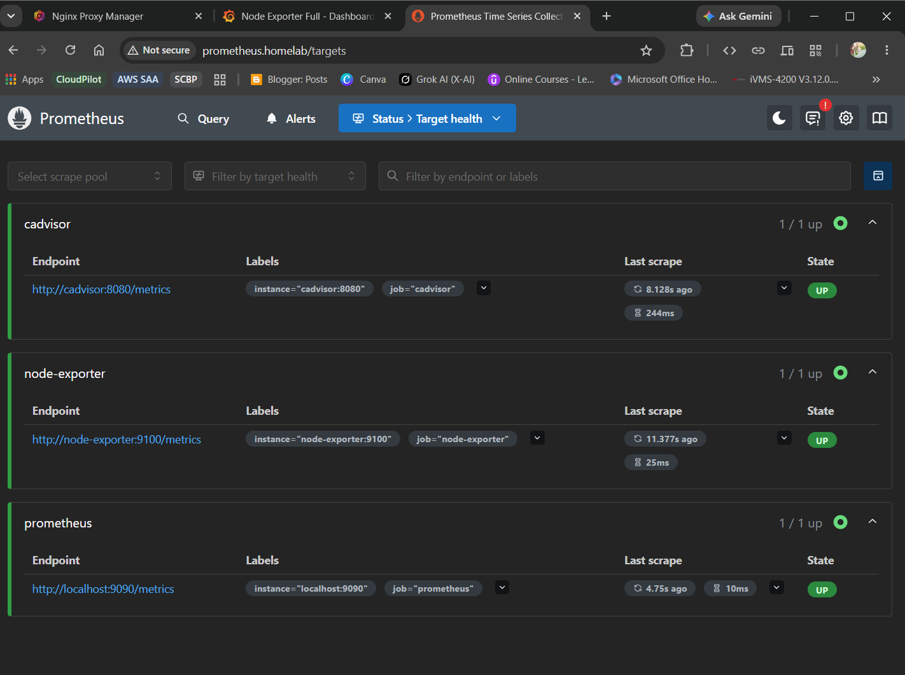
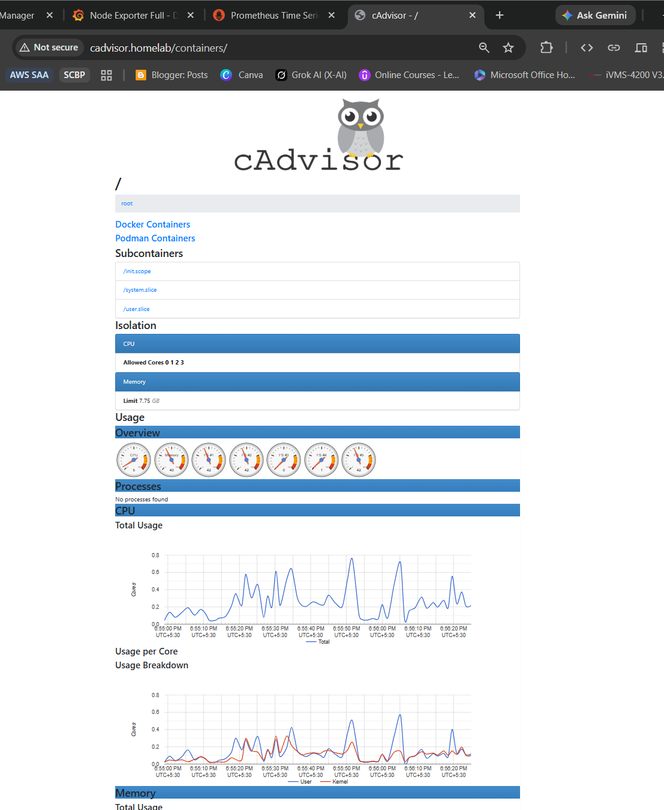
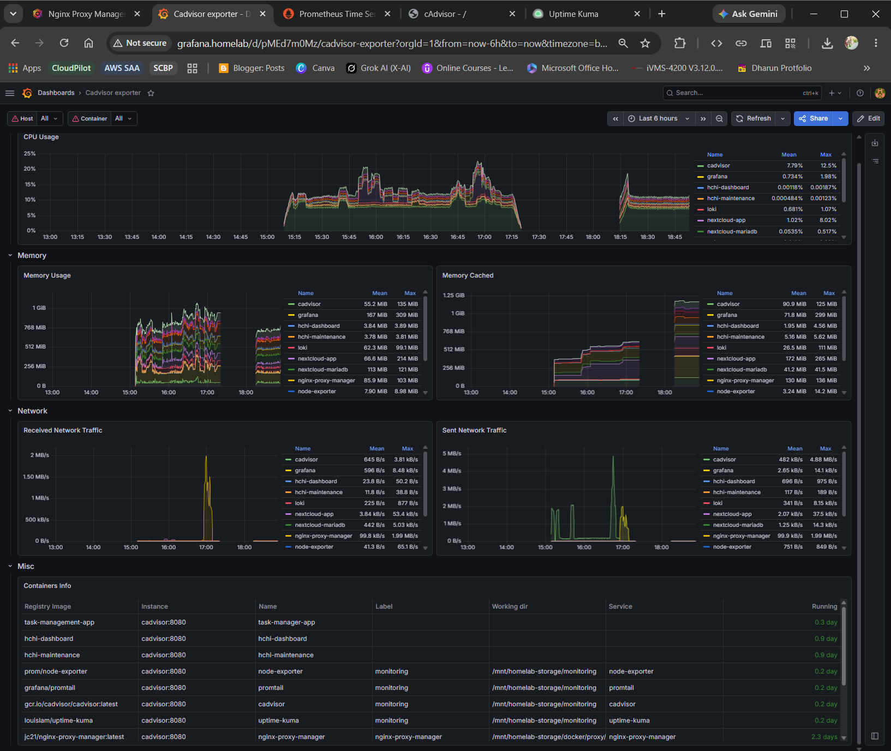
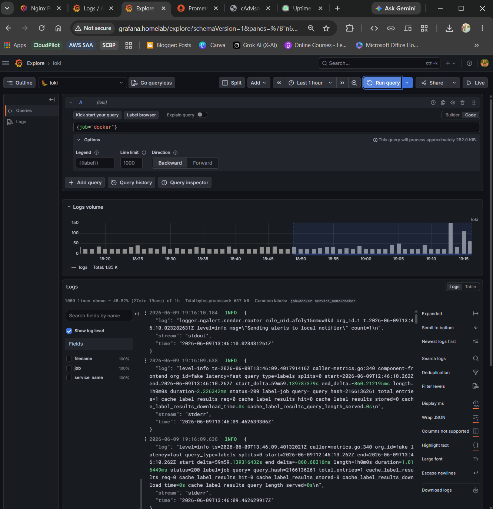
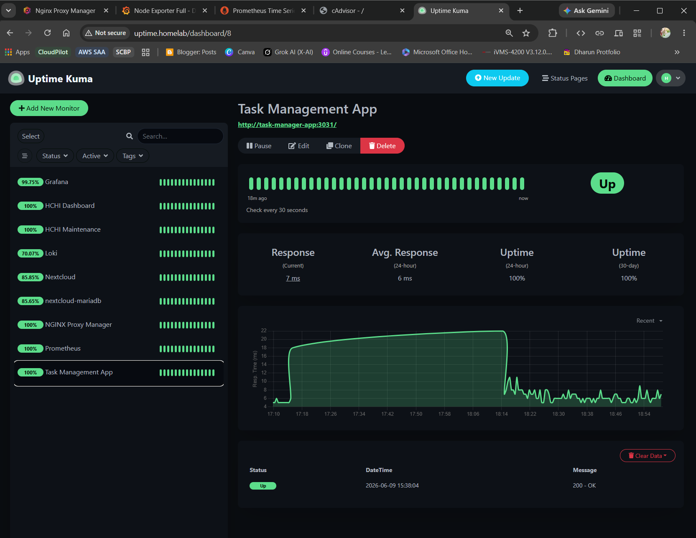
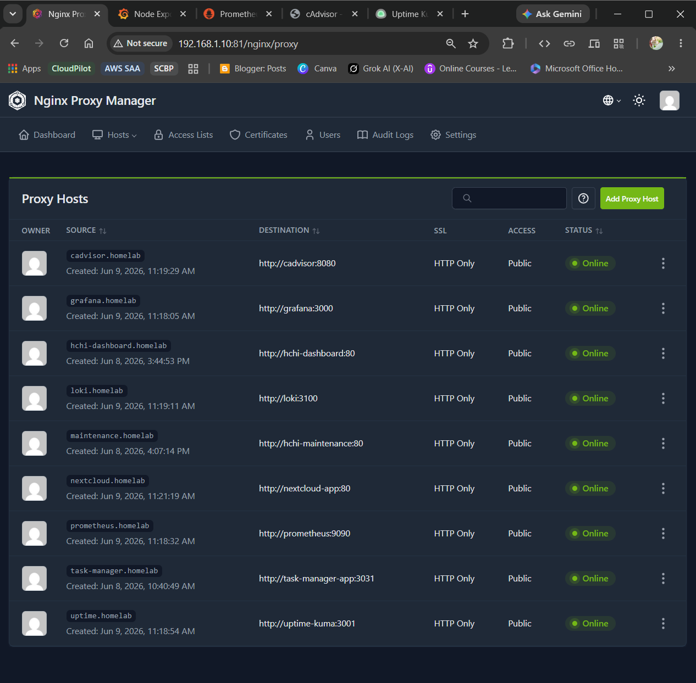

# 📌 Project Overview

Phase-5 introduces a complete **Monitoring & Observability Infrastructure** layer into the Hybrid Cloud HomeLab Infrastructure (HCHI) platform.

This phase transforms the infrastructure into a self-monitoring and observability-enabled platform using enterprise-grade monitoring, centralized logging, uptime monitoring, alerting, and infrastructure analytics technologies.

The platform now supports:

* Real-time infrastructure monitoring
* Container-level observability
* Centralized log aggregation
* Intelligent alerting
* Service uptime monitoring
* Telegram-based incident notifications
* Reverse proxy-based monitoring access
* Internal Docker service discovery
* Infrastructure health analytics

---

# 🎯 Objectives

* Implement infrastructure monitoring
* Monitor Docker containers and services
* Build centralized log aggregation
* Create observability dashboards
* Configure real-time alerting
* Enable uptime monitoring
* Integrate Telegram notifications
* Centralize monitoring services behind reverse proxy infrastructure
* Build production-style observability architecture

---

# 🛠️ Technology Stack

| Component           | Purpose                     |
| ------------------- | --------------------------- |
| Grafana             | Observability dashboards    |
| Prometheus          | Metrics collection          |
| Loki                | Centralized log aggregation |
| Promtail            | Log shipping                |
| Node Exporter       | System metrics              |
| cAdvisor            | Container metrics           |
| Uptime Kuma         | Uptime monitoring           |
| Telegram Bot API    | Real-time notifications     |
| Docker              | Container platform          |
| NGINX Proxy Manager | Reverse proxy routing       |

---

# 🏗️ Observability Architecture

The observability stack was designed using a modular architecture:

* **Prometheus** collects infrastructure and container metrics.
* **Node Exporter** exposes Raspberry Pi system metrics.
* **cAdvisor** provides Docker container resource analytics.
* **Loki** centralizes logs from all containers.
* **Promtail** ships logs into Loki.
* **Grafana** visualizes metrics and logs.
* **Uptime Kuma** monitors application uptime and availability.
* **Telegram Alerts** provide real-time incident notifications.
* **NGINX Proxy Manager** centralizes monitoring access through reverse proxy routing.

<p align="center">
  
</p>

---
---

# 📂 Monitoring Infrastructure Structure

```plaintext
/mnt/homelab-storage/monitoring
│
├── grafana/
│   ├── data/
│   └── provisioning/
│
├── prometheus/
│   └── prometheus.yml
│
├── loki/
│   └── config/
│       └── loki-config.yml
│
├── promtail/
│   └── config/
│       └── promtail-config.yml
│
├── uptime-kuma/
│
├── docker-compose.yml
│
└── monitoring.env

```

---

# 🚀 Monitoring Stack Deployment

## 📊 Grafana Deployment

Grafana was deployed as the central visualization layer for metrics, logs, alerts, and infrastructure dashboards.

### Features Implemented

* Infrastructure dashboards
* Docker monitoring dashboards
* Real-time metrics visualization
* Alert rule engine
* Telegram notification integration
* Loki log exploration

<p align="center">
  
</p>

---

## 📈 Prometheus Metrics Collection

Prometheus was configured as the primary metrics collection engine.

### Monitored Metrics

* CPU usage
* RAM utilization
* Disk usage
* Network traffic
* Container resource usage
* Docker statistics

<p align="center">
  
</p>

---

## 📦 cAdvisor Container Monitoring

cAdvisor was integrated for container-level observability.

### Metrics Collected

* Container CPU usage
* Memory consumption
* Network throughput
* Filesystem usage
* Container uptime

<p align="center">
  
</p>

<p align="center">
  
</p>
---

# 📜 Centralized Logging Infrastructure

## 🔥 Loki Deployment

Loki was deployed as the centralized log aggregation engine.

### Features

* Container log aggregation
* Real-time log streaming
* Log querying
* Infrastructure debugging
* Centralized observability

<p align="center">
  
</p>

---

## 🚚 Promtail Log Shipping

Promtail was configured to collect logs from all Docker containers and forward them into Loki.

### Log Sources

* Grafana
* Prometheus
* Nextcloud
* Task Management App
* NGINX Proxy Manager
* Monitoring services

---

# 🌐 Uptime Monitoring Infrastructure

## 💚 Uptime Kuma Deployment

Uptime Kuma was deployed for service health monitoring and uptime tracking.

### Monitored Services

* Nextcloud
* Grafana
* Prometheus
* Loki
* Task Management App
* NGINX Proxy Manager

### Monitoring Features

* HTTP monitoring
* TCP monitoring
* Health checks
* Incident detection
* Public status pages

<p align="center">
  
</p>

---

# 🚨 Telegram Alerting System

Telegram Bot API integration was configured for real-time infrastructure notifications.

### Alert Types

* Service downtime alerts
* High CPU usage alerts
* Monitoring failures
* Infrastructure incidents
* Service recovery notifications

<p align="center">
  
</p>

---

# 🌐 Reverse Proxy Monitoring Access

Monitoring services were integrated behind NGINX Proxy Manager for centralized ingress routing.

### Monitoring Proxy Hosts

| Domain             | Service     |
| ------------------ | ----------- |
| grafana.homelab    | Grafana     |
| prometheus.homelab | Prometheus  |
| uptime.homelab     | Uptime Kuma |
| loki.homelab       | Loki        |
| cadvisor.homelab   | cAdvisor    |
| nextcloud.homelab  | Nextcloud   |

<p align="center">
  
</p>

---

# 🧠 Internal Docker Service Discovery

The monitoring infrastructure uses a centralized Docker network:

```plaintext
homelab-network
```

This enables:

* Internal DNS resolution
* Container-to-container communication
* Service discovery
* Centralized monitoring access
* Platform-wide observability

---

# 🐞 Engineering Challenges & Debugging

| Challenge                              | Issue                                                                    | Resolution                                                                |
| -------------------------------------- | ------------------------------------------------------------------------ | ------------------------------------------------------------------------- |
| Grafana Database Corruption            | Grafana failed due to SQLite corruption caused by filesystem instability | Repaired ext4 filesystem using fsck, recreated Grafana persistent storage |
| Loki Distributed Configuration Failure | Loki attempted to connect to Consul using distributed mode               | Reconfigured Loki into standalone in-memory ring architecture             |
| Docker DNS & Service Discovery Issues  | Uptime Kuma failed to resolve container hostnames                        | Connected services to `homelab-network` and verified Docker DNS           |
| Nextcloud Trusted Domain Restrictions  | Nextcloud rejected monitoring requests from internal domains             | Updated `trusted_domains` configuration                                   |
| Filesystem Input/Output Errors         | Monitoring stack experienced persistent I/O failures                     | Unmounted storage, repaired filesystem, restarted infrastructure          |
| Reverse Proxy Access Issues            | Internal monitoring services inaccessible via proxy routing              | Integrated services into NGINX Proxy Manager with centralized ingress     |

---

# 📊 Infrastructure Features Achieved

## ✅ Monitoring Features

* Infrastructure monitoring
* Docker container monitoring
* Real-time metrics collection
* Container analytics
* Resource monitoring

## ✅ Logging Features

* Centralized log aggregation
* Real-time log streaming
* Container log analytics
* Infrastructure debugging

## ✅ Alerting Features

* Telegram notifications
* Uptime alerts
* Infrastructure alerts
* Incident detection

## ✅ Platform Features

* Reverse proxy monitoring access
* Internal Docker DNS
* Centralized ingress architecture
* Production-style observability stack

---

# ✅ Final Result

Phase-5 successfully transformed the Hybrid Cloud HomeLab Infrastructure (HCHI) platform into a fully observable infrastructure platform with:

* Real-time monitoring
* Centralized logging
* Infrastructure analytics
* Docker observability
* Uptime monitoring
* Intelligent alerting
* Internal service discovery
* Reverse proxy monitoring access

The infrastructure now behaves like a production-grade platform engineering environment running entirely on a Raspberry Pi 5.

---

---

# 👨‍💻 Author

**Dharun R**

Hybrid Cloud HomeLab Infrastructure (HCHI)

---
