# 🚀 Phase-4 — Intelligent Routing & CI/CD Automated Hosting Infrastructure

## Hybrid Cloud HomeLab Infrastructure (HCHI)

---

# 📌 Phase Overview

Phase-4 of the Hybrid Cloud HomeLab Infrastructure (HCHI) focuses on building a self-hosted intelligent deployment and routing platform using Raspberry Pi 5, Docker, GitHub Actions, NGINX Proxy Manager, and automated deployment orchestration.

This phase transforms the infrastructure from a simple Docker hosting environment into a reusable platform engineering architecture capable of:

- self-hosted CI/CD
- automated deployments
- intelligent reverse proxy routing
- deployment lifecycle orchestration
- centralized deployment management
- health-aware deployments
- failover routing
- graceful degradation handling

The infrastructure is designed to simulate real-world platform engineering workflows while remaining lightweight, open-source, and fully self-hosted.

---

# 🎯 Phase-4 Objectives

- Build reusable deployment infrastructure
- Implement self-hosted CI/CD workflows
- Create intelligent reverse proxy routing
- Automate Docker application deployments
- Standardize deployable application architecture
- Implement centralized deployment registry system
- Create failover routing architecture
- Build health-aware deployment validation
- Simulate enterprise-grade platform engineering concepts

---

# 🏗️ Phase-4 Architecture Overview

<p align="center">
  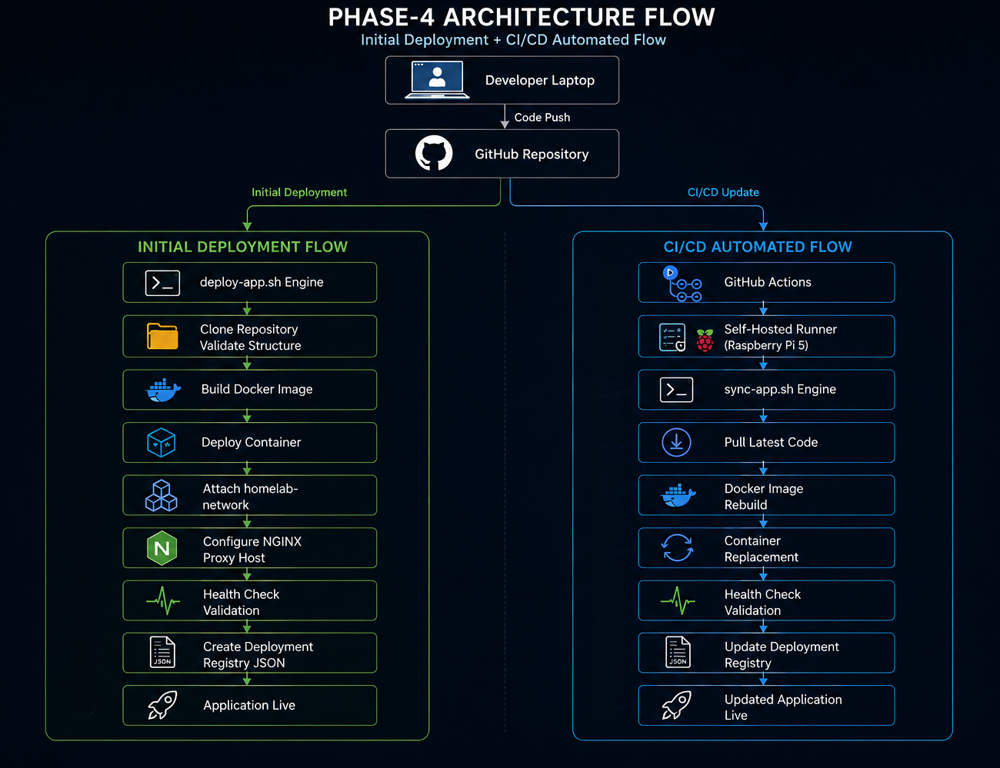
</p>

---

# ⚙️ Final Infrastructure Flow

```text
Developer Laptop
        ↓
Git Push
        ↓
GitHub Repository
        ↓
GitHub Actions
        ↓
Self-Hosted Runner (Raspberry Pi 5)
        ↓
HCHI Sync Engine (sync-app.sh)
        ↓
Docker Image Rebuild
        ↓
Container Replacement
        ↓
NGINX Proxy Manager
        ↓
Internal Intelligent Routing
        ↓
Application Live
````

---

# 🧠 Intelligent Failover Routing Flow

```text
User Request
        ↓
NGINX Proxy Manager
        ↓
Application Healthy?
        ↓ YES
Serve Main Application

        ↓ NO
Serve HCHI Maintenance Container
```

<p align="center">
  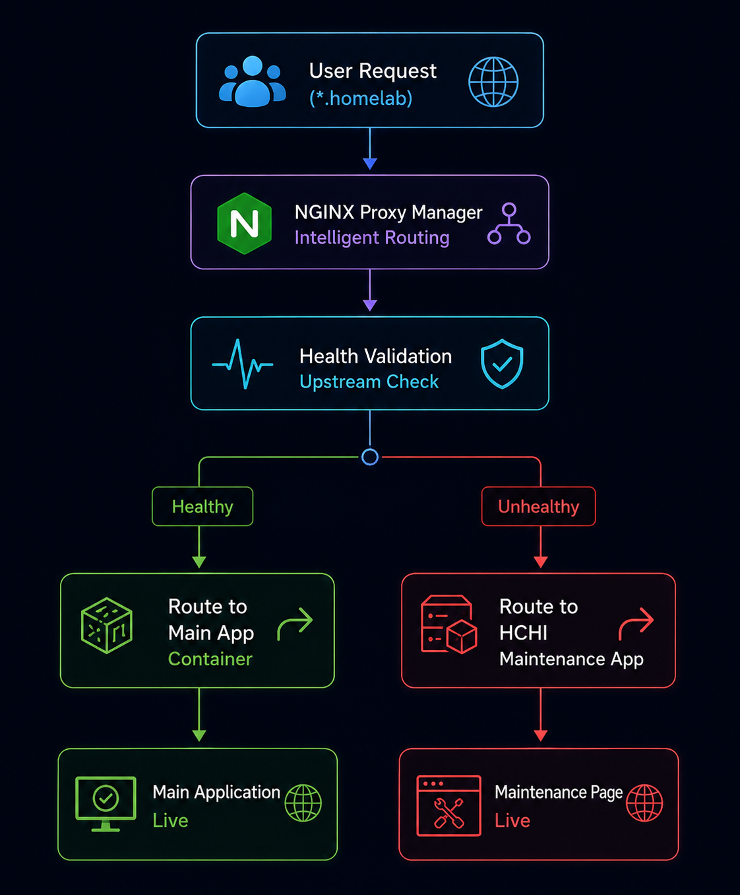
</p>

---

# 🧱 Infrastructure Stack

| Component                  | Purpose                                |
| -------------------------- | -------------------------------------- |
| Raspberry Pi 5             | Self-hosted infrastructure node        |
| Docker                     | Containerized application platform     |
| Docker Network             | Internal service communication         |
| NGINX Proxy Manager        | Intelligent reverse proxy routing      |
| GitHub Actions             | CI/CD automation                       |
| Self-hosted Runner         | Local deployment execution             |
| deploy-app.sh              | Initial application deployment engine  |
| sync-app.sh                | Automated CI/CD synchronization engine |
| delete-app.sh              | Deployment lifecycle cleanup engine    |
| Deployment Registry        | Centralized deployment metadata        |
| HCHI Maintenance Container | Intelligent failover routing           |

---

# 📂 Platform Folder Structure

```text
/mnt/homelab-storage/platform/
│
├── apps/
│   ├── Task-management-app/
│   ├── hchi-dashboard/
│   └── hchi-maintenance/
│
├── deployments/
│   ├── task-management-app.json
│   ├── hchi-dashboard.json
│   └── hchi-maintenance.json
│
├── logs/
│   ├── task-management-app.log
│   ├── hchi-dashboard.log
│   └── hchi-maintenance.log
│
└── scripts/
    ├── deploy-app.sh
    ├── sync-app.sh
    └── delete-app.sh
```

---

# 📦 HCHI Deployable Application Standard

Every application deployed into HCHI follows a standardized deployment structure.

## Standard Structure

```text
app-name/
├── Dockerfile
├── deployment.json
├── .dockerignore
├── README.md
├── .github/
│   └── workflows/
│       └── deploy.yml
├── backend/
├── frontend/
└── application source code
```

---

# 📄 deployment.json Example

```json
{
  "app_name": "task-management-app",
  "container_name": "task-manager-app",
  "internal_domain": "task-manager.homelab",
  "container_port": 3031,
  "host_port": 3031,
  "health_endpoint": "/api/health",
  "restart_policy": "unless-stopped",
  "network": "homelab-network"
}
```

---

# ⚡ Deployment Lifecycle Architecture

The HCHI platform automates the complete deployment lifecycle.

## Initial Deployment Flow

```text
deploy-app REPOSITORY_URL
        ↓
Clone Repository
        ↓
Validate Deployment Standard
        ↓
Build Docker Image
        ↓
Deploy Container
        ↓
Attach homelab-network
        ↓
Configure NGINX Proxy Host
        ↓
Perform Health Check
        ↓
Generate Deployment Registry
        ↓
Application Live
```

<p align="center">
  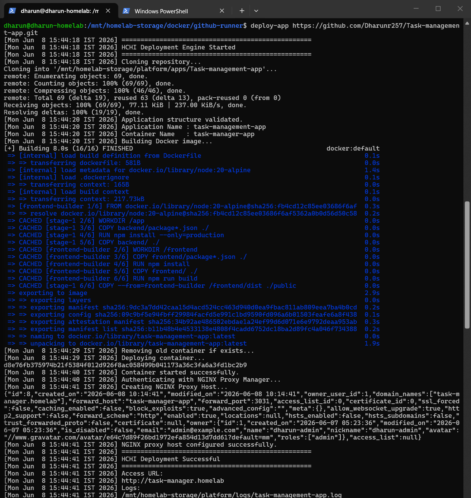
</p>

---

# 🔄 CI/CD Synchronization Workflow

The platform includes a fully automated self-hosted CI/CD pipeline.

## Automated Sync Flow

```text
Git Push
        ↓
GitHub Actions Trigger
        ↓
Self-hosted Runner
        ↓
sync-app.sh
        ↓
Pull Latest Code
        ↓
Docker Image Rebuild
        ↓
Container Replacement
        ↓
Health Validation
        ↓
Deployment Registry Update
        ↓
Updated Application Live
```

<p align="center">
  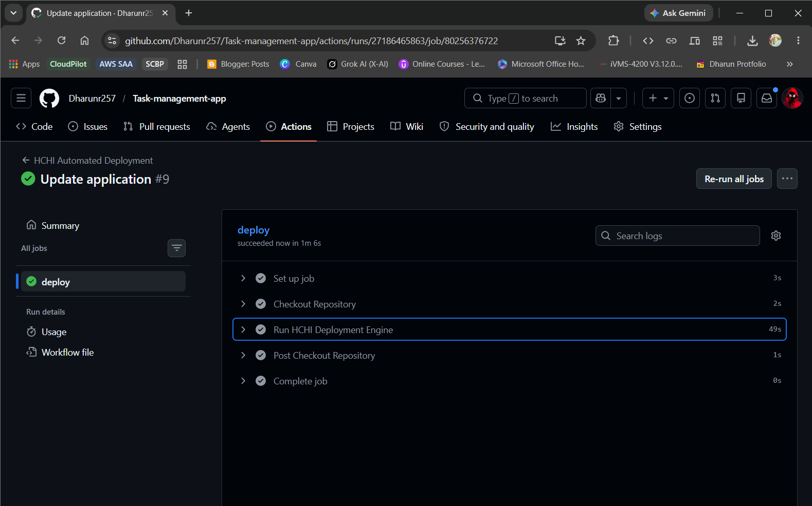
</p>

<p align="center">
  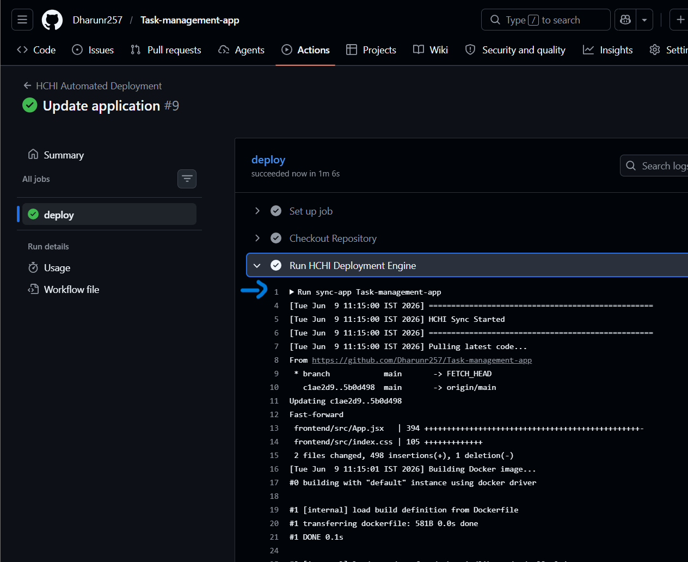
</p>

---

# 🌐 Intelligent Routing Architecture

The HCHI platform uses centralized reverse proxy routing using NGINX Proxy Manager.

## Internal Routing Example

```text
task-manager.homelab
        ↓
NGINX Proxy Manager
        ↓
task-manager-app
        ↓
Docker Container
```

<p align="center">
  
</p>

<p align="center">
  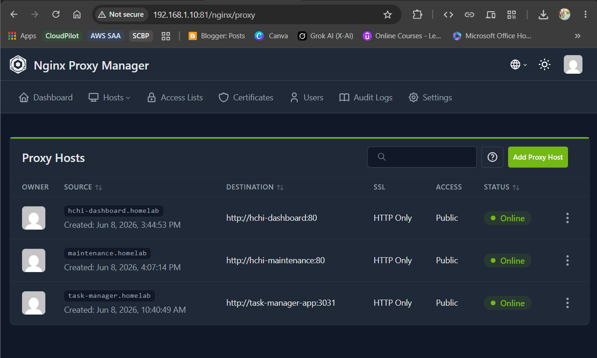
</p>

---

# 🛡️ Intelligent Failover Routing

One of the major Phase-4 features is failover-aware routing.

If an application becomes unavailable, requests are automatically redirected to the centralized maintenance container.

## Failover Logic

```text
Application Running?
        ↓ YES
Serve Main Application

        ↓ NO
Serve Maintenance Application
```

<p align="center">
  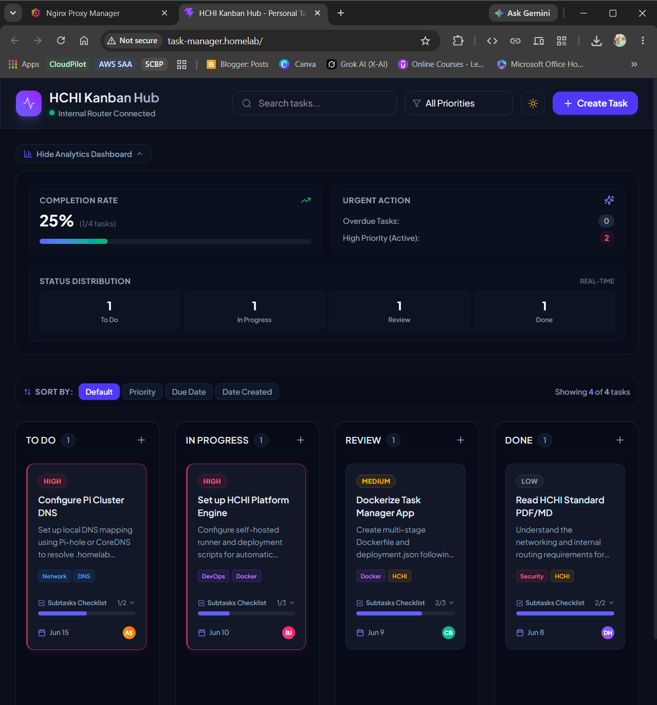
</p>

<p align="center">
  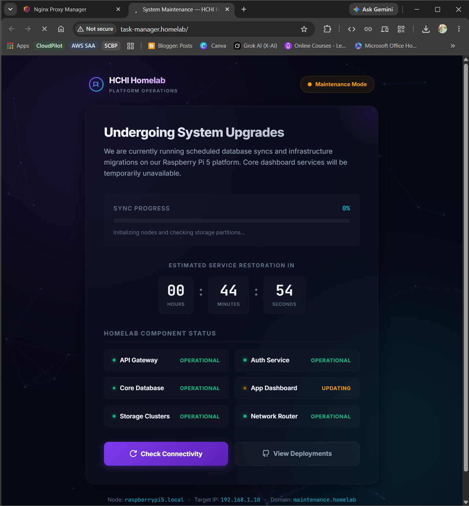
</p>

---

# 🧪 Health Monitoring System

The deployment engine validates application health after every deployment.

## Health Check Example

```bash
curl -s http://localhost:3031/api/health | jq
```

Deployment registry status:

```json
{
  "deployment_status": "healthy"
}
```

<p align="center">
  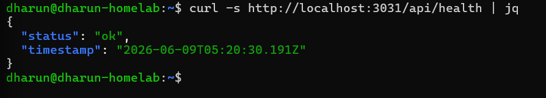
</p>

---

# 🗂️ Deployment Registry System

Every deployed application automatically generates deployment metadata.

## Example Registry File

```text
/platform/deployments/task-management-app.json
```

## Registry Example

```json
{
  "app_name": "task-management-app",
  "container_name": "task-manager-app",
  "internal_domain": "task-manager.homelab",
  "deployment_status": "healthy",
  "docker_image": "task-management-app:latest"
}
```

The registry system acts as the centralized source of truth for deployed applications.

<p align="center">
  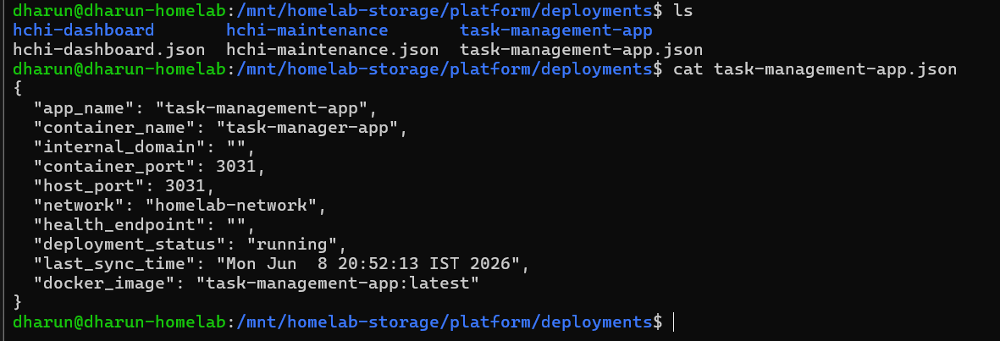
</p>

---

# 🧰 HCHI Platform Scripts

| Script        | Purpose                      |
| ------------- | ---------------------------- |
| deploy-app.sh | Initial deployment engine    |
| sync-app.sh   | CI/CD synchronization engine |
| delete-app.sh | Deployment cleanup engine    |

<p align="center">
  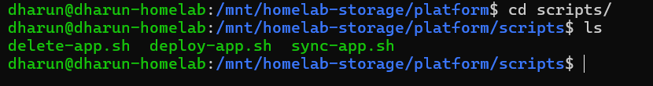
</p>

---

# 🚀 Implementation Walkthrough

This section demonstrates the complete Phase-4 deployment implementation flow.

---

## Step 1 — Deploy Application

```bash
deploy-app https://github.com/Dharunr257/Task-management-app.git
```

<p align="center">
  
</p>

---

## Step 2 — Verify Running Containers

```bash
docker ps
```

<p align="center">
  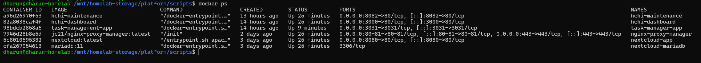
</p>

---

## Step 3 — Verify Docker Network

```bash
docker network ls
docker network inspect homelab-network
``` 

<p align="center">
  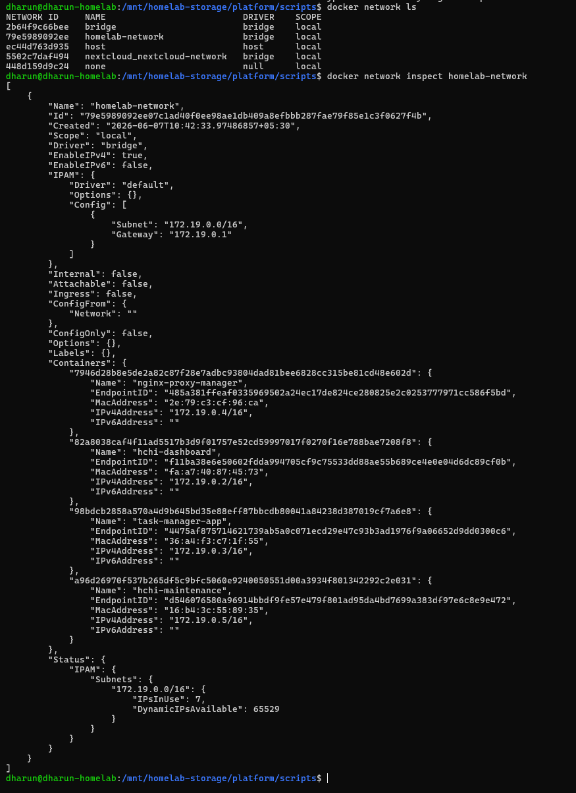
</p>

---

## Step 4 — Verify NGINX Proxy Hosts

Open:

```text
http://PI-IP:81
```

<p align="center">
  
</p>

---

## Step 5 — Access Application

```text
http://task-manager.homelab
```

<p align="center">
  
</p>

---

# 🔁 CI/CD Demonstration

## Push Update

```bash
git add .

git commit -m "Update application"

git push
```

<p align="center">
  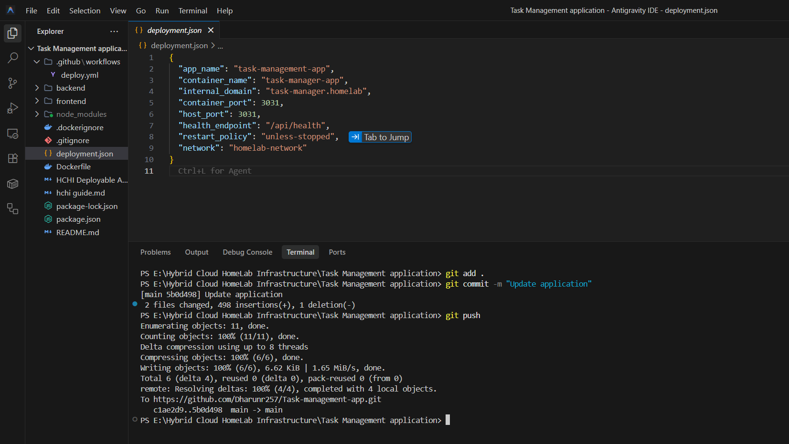
</p>

---

## Automated Deployment Trigger

```text
GitHub Actions
        ↓
Self-hosted Runner
        ↓
sync-app.sh
        ↓
Application Updated Automatically
```

<p align="center">
  
</p>

---

# ⚠️ Intelligent Failover Demonstration

## Stop Main Application

```bash
docker stop task-manager-app
```

<p align="center">
  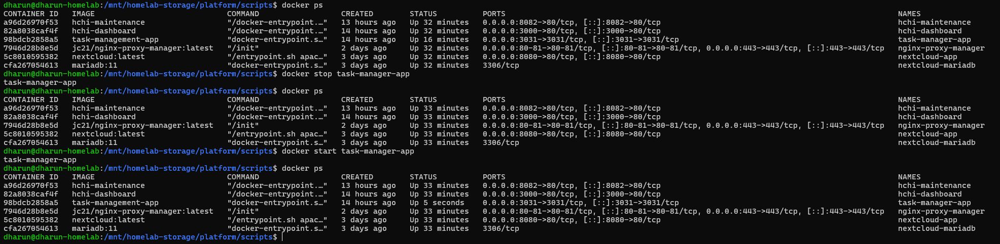
</p>

---

## Automatic Maintenance Redirection

```text
task-manager.homelab
        ↓
Automatically redirected
        ↓
HCHI Maintenance Application
```

<p align="center">
  
</p>

---

## Restore Main Application

```bash
docker start task-manager-app
```

<p align="center">
  
</p>

---

# 🧩 Key Challenges & Debugging Journey

During implementation, several infrastructure-level challenges were encountered and resolved.

## Major Challenges

* Docker network alias resolution
* Reverse proxy container communication
* Internal routing validation
* GitHub self-hosted runner management
* Automated NGINX proxy creation
* Health-aware deployment validation
* Failover routing implementation
* Deployment lifecycle consistency

---

# 📚 Key Learnings

* Self-hosted CI/CD architecture
* Docker networking & bridge communication
* Reverse proxy routing strategies
* Health-aware deployment systems
* Intelligent failover routing
* Platform engineering workflows
* Infrastructure automation patterns
* Deployment orchestration concepts

---

# 🔮 Future Improvements

Planned future upgrades include:

* automated rollback system
* deployment dashboard APIs
* advanced observability stack
* Prometheus & Grafana monitoring
* centralized platform dashboard
* load balancing
* multi-node failover routing
* automatic SSL management
* Kubernetes migration experiments

---

# 🏁 Final Outcome

Phase-4 successfully transformed the Hybrid Cloud HomeLab Infrastructure into a self-hosted intelligent deployment and routing platform capable of:

* automated CI/CD
* intelligent reverse proxy routing
* deployment lifecycle automation
* failover-aware infrastructure behavior
* reusable deployment orchestration
* scalable multi-application hosting

The infrastructure now simulates real-world platform engineering workflows using fully self-hosted open-source tooling running on Raspberry Pi 5 infrastructure.

<p align="center">
  
</p>

---

```
```
