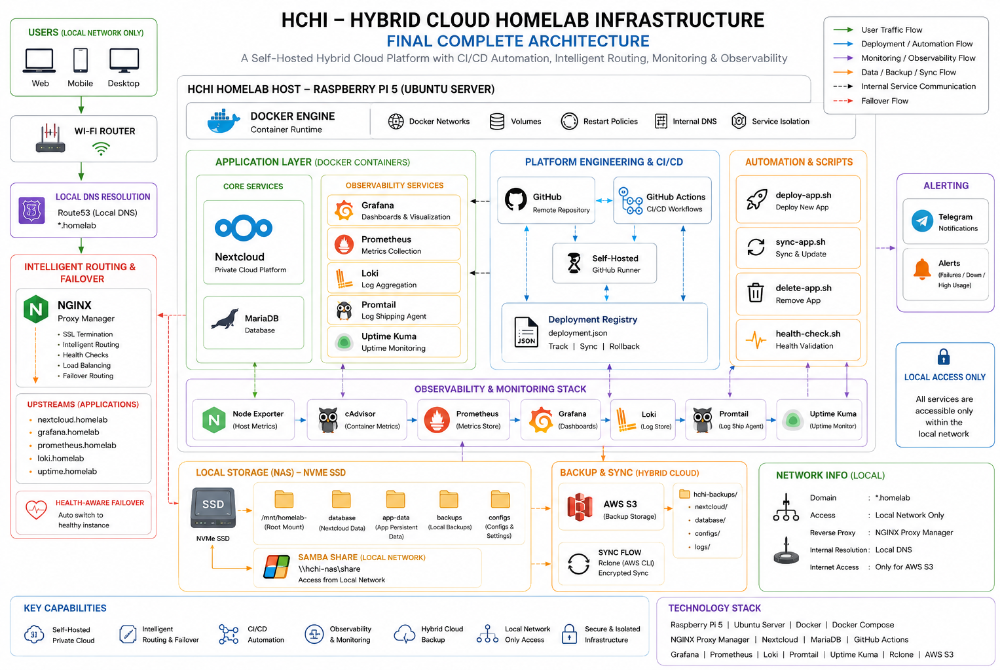

# Hybrid Cloud HomeLab Infrastructure (HCHI)

<p align="center">
  
</p>

<p align="center">
  Enterprise-grade Hybrid Cloud Infrastructure built using Raspberry Pi 5, Docker, AWS, CI/CD Automation, Intelligent Routing, and Full Observability Engineering.
</p>

---

<p align="center">
  
  
  
  
  
  
</p>

---

# Project Vision

After earning the AWS Solutions Architect Associate certification, I realized that modern cloud platforms abstract away much of the underlying infrastructure complexity.

While cloud services simplify deployment and operations, I wanted to deeply understand the actual engineering problems these services were designed to solve.

Instead of starting directly with managed cloud services and console-driven workflows, I intentionally began from the infrastructure layer itself:

- self-hosted storage
- Linux server administration
- containerized workloads
- reverse proxy routing
- CI/CD automation
- observability systems
- networking
- deployment workflows
- failover handling
- infrastructure troubleshooting

Cloud platforms are ultimately built on top of real infrastructure, networking, automation, storage systems, and operational engineering principles.

So rather than only experiencing the solutions provided by cloud platforms, I wanted to first experience the actual operational challenges behind them.

This project became a hands-on journey into understanding the foundations behind:

- cloud engineering
- DevOps
- platform engineering
- observability
- networking
- infrastructure reliability
- operational troubleshooting

What initially started as separate infrastructure experiments eventually evolved into a single large-scale phased infrastructure ecosystem called **Hybrid Cloud HomeLab Infrastructure (HCHI)**.

---

# Project Highlights

| Infrastructure Capability | Description |
|---|---|
| Hybrid Cloud Architecture | Combined self-hosted infrastructure with cloud-integrated backup workflows |
| Self-Hosted Private Cloud | Built a complete private cloud stack using Nextcloud and Docker |
| Platform Engineering | Centralized deployment workflows and automated infrastructure operations |
| CI/CD Automation | Implemented automated deployment pipelines using self-hosted GitHub Actions runners |
| Intelligent Routing | Reverse proxy-based internal routing with health-aware failover mechanisms |
| Observability Stack | Integrated monitoring, centralized logging, uptime monitoring, and alerting |
| Infrastructure Automation | Automated deployment, synchronization, and cleanup workflows |
| Persistent Storage Infrastructure | Structured persistent volume management using NVMe SSD architecture |
| Monitoring & Reliability | Real-time metrics, dashboards, logging pipelines, and Telegram alerts |
| Production-Style Architecture | Simulated real infrastructure engineering workflows on a self-hosted environment |

---

# Final Architecture

The final HCHI architecture combines:

- hybrid cloud storage
- platform engineering workflows
- observability infrastructure
- CI/CD automation
- reverse proxy routing
- containerized application hosting
- centralized monitoring
- backup automation

into a unified self-hosted infrastructure ecosystem.

<p align="center">
  
</p>

The infrastructure is built around a Raspberry Pi 5 running Ubuntu Server with Dockerized services, persistent NVMe storage, internal networking, automated deployment systems, monitoring pipelines, and cloud-integrated backup workflows.

---

# Infrastructure Phases Overview

| Phase | Engineering Focus | Core Infrastructure | Documentation |
|---|---|---|---|
| Phase 1 | NAS Infrastructure Foundation | Samba, NVMe Storage, Ubuntu Server | `/phase-1-nas-foundation/README.md` |
| Phase 2 | Private Cloud Infrastructure | Nextcloud, MariaDB, Docker | `/phase-2-private-cloud/README.md` |
| Phase 3 | Hybrid Cloud Storage | AWS S3 Backup Integration | `/phase-3-hybrid-storage/README.md` |
| Phase 4 | Platform Engineering & CI/CD | GitHub Actions, NGINX Proxy Manager | `/phase-4-platform-engineering/README.md` |
| Phase 5 | Monitoring & Observability | Grafana, Prometheus, Loki | `/phase-5-observability/README.md` |

---

# Phase 1 — NAS Infrastructure & Core Foundation

## Objective

Phase 1 focused on building the foundational infrastructure layer for the entire HCHI ecosystem. The goal was to create a reliable self-hosted NAS environment with persistent storage architecture, network sharing, and structured storage management using Raspberry Pi 5 and NVMe SSD storage.

## Architecture

<p align="center">
  
</p>

## Infrastructure Showcase

### NAS Infrastructure

<p align="center">
  
  
</p>

### Storage Foundation

<p align="center">
  
</p>

---

# Phase 2 — Private Cloud Infrastructure

## Objective

Phase 2 transformed the infrastructure into a fully functional self-hosted private cloud platform using Dockerized Nextcloud services, MariaDB integration, persistent volume architecture, and containerized storage management.

## Architecture

<p align="center">
  
</p>

## Infrastructure Showcase

### Nextcloud Infrastructure

<p align="center">
  
  
</p>

### Persistent Storage Architecture

<p align="center">
  
</p>

---

# Phase 3 — Hybrid Cloud Storage Infrastructure

## Objective

Phase 3 introduced hybrid cloud architecture concepts by integrating AWS S3 backup workflows, automated synchronization pipelines, cloud redundancy strategies, and disaster recovery-oriented storage automation.

## Architecture

<p align="center">
  
</p>

## Infrastructure Showcase

### Hybrid Cloud Backup Pipeline

<p align="center">
  
  
</p>

### Backup Automation

<p align="center">
  
</p>

---

# Phase 4 — Intelligent Routing & CI/CD Infrastructure

## Objective

Phase 4 evolved the homelab into a platform engineering environment capable of automated CI/CD-driven deployments, intelligent reverse proxy routing, deployment tracking, and health-aware failover handling.

## Architecture

<p align="center">
  
</p>

## Infrastructure Showcase

### CI/CD Infrastructure

<p align="center">
  
  
  
</p>

### Intelligent Routing & Failover

<p align="center">
  
  
</p>

---

# Phase 5 — Monitoring & Observability Infrastructure

## Objective

Phase 5 introduced centralized monitoring, metrics collection, log aggregation, uptime monitoring, and real-time alerting to create a complete observability stack for the HCHI infrastructure.

## Architecture

<p align="center">
  
</p>

## Infrastructure Showcase

### Monitoring Dashboards

<p align="center">
  
  
</p>

### Observability Stack

<p align="center">
  
  
</p>

---

# Full Folder Structure

```bash
Hybrid-Cloud-HomeLab-Infrastructure/
│
├── README.md
├── docs/
│   ├── architecture/
│   ├── screenshots/
│   ├── diagrams/
│   └── workflows/
│
├── phase-1-nas-foundation/
├── phase-2-private-cloud/
├── phase-3-hybrid-storage/
├── phase-4-platform-engineering/
├── phase-5-observability/
│
├── scripts/
├── deployment-templates/
├── monitoring-configs/
├── nginx-configs/
└── backup-configs/
```

---

# Complete Technology Stack

| Layer | Technologies |
|---|---|
| Infrastructure | Raspberry Pi 5, Ubuntu Server |
| Containerization | Docker, Docker Compose |
| Cloud Integration | AWS S3, IAM |
| Private Cloud | Nextcloud, MariaDB |
| Platform Engineering | GitHub Actions, Self-Hosted Runner |
| Reverse Proxy | NGINX Proxy Manager |
| Monitoring | Grafana, Prometheus, Loki, Promtail |
| Uptime Monitoring | Uptime Kuma |
| Storage | NVMe SSD, Samba |
| Networking | Docker Networks, Reverse Proxy Routing |
| Automation | Shell Scripting, Deployment Workflows |

---

# Cloud, Networking & DevOps Features

| Domain | Implemented Concepts |
|---|---|
| Cloud Engineering | Hybrid cloud storage integration, AWS S3 backup architecture, IAM access management |
| Networking | Reverse proxy routing, internal Docker networking, trusted domain architecture |
| DevOps | CI/CD automation, deployment synchronization, automated health validation |
| Platform Engineering | Deployment registry system, centralized deployment scripts, automated workflows |
| Observability | Metrics collection, centralized logging, uptime monitoring, Telegram alerting |
| Reliability Engineering | Health-aware failover routing, monitoring-driven visibility, restart policies |

---

# Security Features

| Security Layer | Implementation |
|---|---|
| Access Control | IAM-based cloud access policies and isolated infrastructure services |
| Network Isolation | Internal Docker networking and service segmentation |
| Persistent Storage Protection | Dedicated persistent storage architecture and backup workflows |
| Reverse Proxy Security | Trusted domains and controlled internal routing |
| Monitoring Security | Isolated observability infrastructure and protected service communication |

---

# Performance & Reliability

The HCHI infrastructure was designed to operate efficiently on lightweight hardware while maintaining production-style reliability and operational visibility.

The infrastructure uses Dockerized services with persistent storage separation, restart policies, health validation workflows, centralized monitoring, and automated observability pipelines to ensure stable operation.

| Reliability Capability | Implementation |
|---|---|
| Automated Recovery | Docker restart policies |
| Service Monitoring | Prometheus + Uptime Kuma |
| Log Visibility | Loki centralized logging |
| Health Validation | Deployment health checks |
| Routing Reliability | Intelligent failover routing |
| Persistent Storage | NVMe-based storage architecture |

---

# Engineering Challenges & Debugging Journey

One of the most valuable aspects of HCHI was experiencing real infrastructure issues and troubleshooting them at the operational level.

| Challenge | Root Cause | Solution |
|---|---|---|
| Grafana database corruption | SQLite filesystem corruption | Rebuilt persistent database infrastructure |
| Loki deployment instability | Distributed mode configuration issues | Migrated to standalone architecture |
| Docker DNS discovery failures | Internal network resolution problems | Redesigned container networking |
| Reverse proxy routing issues | Incorrect upstream configurations | Reconfigured proxy routing logic |
| Filesystem corruption | Unexpected storage-level I/O issues | Performed filesystem repair and validation |
| Container communication failures | Misconfigured service discovery | Standardized Docker network architecture |

---

# What I Learned

HCHI became much more than a homelab project.

Building the infrastructure phase-by-phase provided hands-on exposure to:

- infrastructure engineering
- Linux system administration
- container orchestration concepts
- networking fundamentals
- reverse proxy systems
- deployment automation
- platform engineering workflows
- monitoring & observability
- infrastructure troubleshooting
- operational reliability

More importantly, the project helped me understand the real operational problems modern cloud platforms are designed to solve.

Instead of only interacting with managed cloud abstractions, this project allowed me to experience the underlying infrastructure workflows, deployment challenges, monitoring requirements, networking complexities, and debugging processes directly.

That experience significantly strengthened my understanding of cloud engineering from a foundational infrastructure perspective.

---

# Connect With Me

- GitHub: https://github.com/
- LinkedIn: https://linkedin.com/

---

# Final Showcase Statement

HCHI represents my journey into infrastructure engineering, platform engineering, DevOps automation, networking, observability, and hybrid cloud architecture — built from the ground up to understand the real operational foundations behind modern cloud systems.
